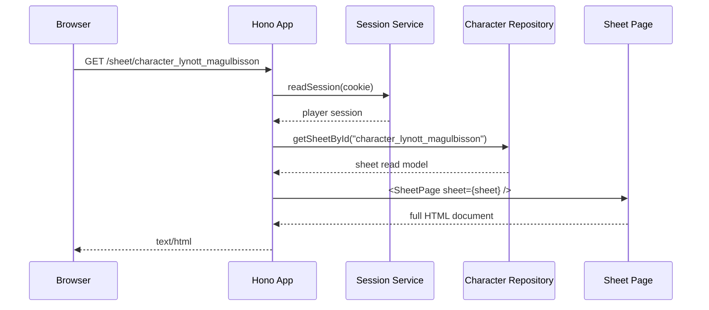
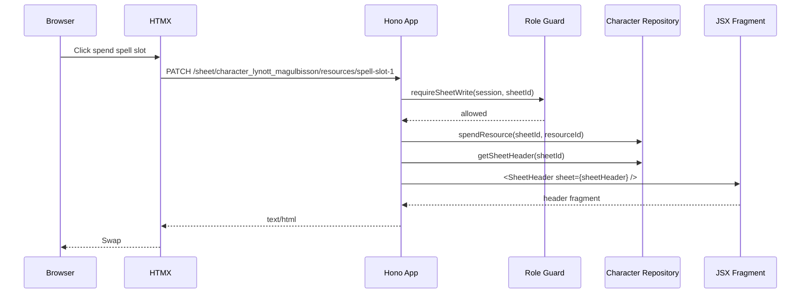
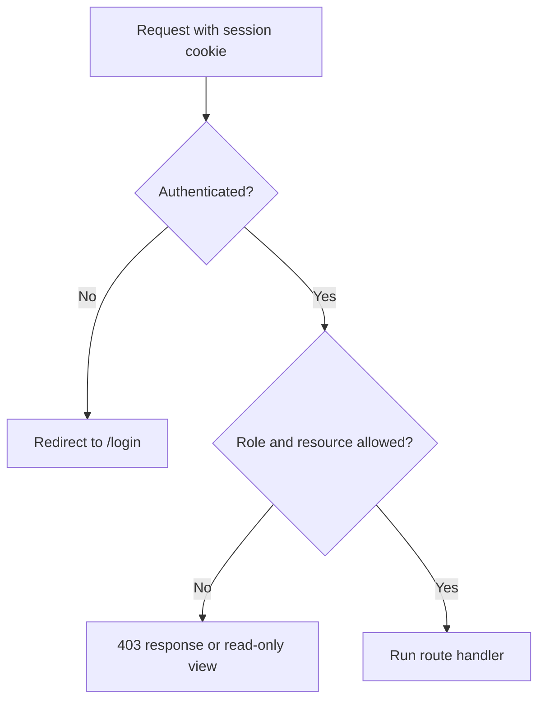
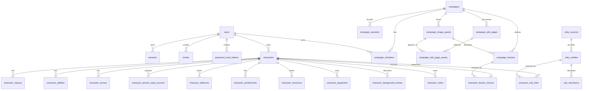
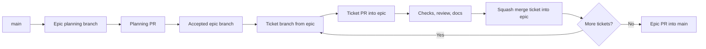

# Architecture

Campaign Ledger is a local-first D&D 5e sheet app built with Hono, HTMX, Bun, TypeScript, JSX, and SQLite.

The first MVP supports a seeded local workflow for Lynott Magulbisson, Mira Voss, one Game Master, and one admin. It is intentionally designed as a server-rendered application, not a static markdown viewer: the database stores both durable character state and structured rules data, routes own mutation and permission checks, JSX components own semantic markup, and HTMX owns focused fragment swaps.

Railway deployment has a hosted rehearsal path from `sheet-0030` for the existing SQLite app. `sheet-0050` adds the campaign companion layer: public SRD rules, browser-local play, admin handoff, capability combinations, campaign private rules, richer rules rendering, Mira sheet content, and compact table-use layouts. A Postgres migration remains out of scope. The MVP should keep running locally with SQLite and keep the architecture compatible with a later database adapter.

## Goals

- Keep runtime setup separate from app construction.
- Use SQLite as the local source of truth for users, sheets, notes, mutable state, and structured rules data.
- Seed enough D&D 2014 rules data to support Lynott and Mira, and import the accepted SRD 5.1 corpus for public rules browsing.
- Normalise official 2014 material to the most recent 2014 reprint when sources overlap.
- Use British English in user-facing copy, code naming, and CSS custom properties.
- Enforce capability-aware access for player, Game Master, and admin flows, including combined admin/player or admin/Game Master users.
- Render full pages and HTMX fragments from the same component tree.
- Keep persistence behind repository and service interfaces so a later Postgres epic does not rewrite route code.
- Use a TDD approach for repositories, services, routes, components, HTMX contracts, accessibility, and screenshots.

## Core Shape

The app follows the Hyper-Dank template lineage. `sheet-0040` replaces matching app-local framework
pieces with the current Hyper-Dank packages: `@macavitymadcap/hyper-dank-ui`,
`@macavitymadcap/hyper-dank-data`, `@macavitymadcap/hyper-dank-transport`, and
`@macavitymadcap/hyper-dank-automation`. Domain routes, schemas, repositories, sheet controls,
campaign flows, and product copy stay app-owned.

`sheet-0041` initially consumed those packages through vendored local tarballs built from Hyper-Dank
`hyper-dank-v2.3.1`. Hyper-Dank's packages are now npm-published at the same public package paths,
so Campaign Ledger resolves them through normal semver dependency ranges. The `test:hyper-dank`
script is the compatibility gate for those public imports.

`sheet-0044` keeps SQLite schema bootstrap, seed data, and repositories app-owned, but exposes the
SQLite runtime through Hyper-Dank's `DatabaseProviderBase` lifecycle shape and a provider registry.
That gives later runtime or adapter work a shared provider boundary without introducing Postgres,
Better Auth, or shared domain repositories.

`sheet-0045` adopts Hyper-Dank automation mechanics for command execution and Pa11y target running.
Campaign Ledger still owns its verification gate order, Pa11y route list, smoke workflow, screenshot
targets, and the temporary screenshot directory used by routine `bun run verify`.

`sheet-0046` keeps the remaining local boundary explicit: adopted generic UI components are thin
Hyper-Dank re-export shims only when existing Campaign Ledger import paths or CSS hooks need to stay
stable, and `scripts/lib/local-app.ts` re-exports shared automation readiness helpers while retaining
the Campaign Ledger-specific in-memory app and HTTP server harness. Hyper-Dank version updates are
deliberate: `bun.lock` pins the installed package versions, `bun run update:hyper-dank` refreshes the
four shared packages, and `test:hyper-dank` flags newly exported UI components that overlap local
Campaign Ledger component names before they are reviewed.

The full MVP source tree is expected to grow towards this shape as tickets land:

```text
src/
├── index.ts                    # Bun runtime entrypoint
├── app.tsx                     # Hono app factory
├── auth/                       # password, sessions, role guards
├── characters/                 # character read models, validation, services
├── rules/                      # rules import, normalisation, and read models
├── notes/                      # player and Game Master notes
├── db/                         # schema, repository contracts, SQLite implementation
├── components/                 # server-rendered JSX components
│   ├── atoms/
│   ├── molecules/
│   ├── organisms/
│   ├── pages/
│   ├── templates/
│   └── styles.ts
└── test/                       # shared app and repository harnesses
```

`src/index.ts` owns process setup through `resolveRuntimeConfig()`: host and port environment variables, the SQLite filename, repository construction, auth/session service construction, schema bootstrap, and the Bun `fetch` export. Startup deliberately does not seed mutable data. Railway-specific service configuration lives in [`railway.json`](./railway.json), hosted seed, backup, restore, and migration operations are documented in [Railway Hosted Rehearsal](./docs/deployment/railway.md), and manual account handoff is documented in [Hosted Account Operator Runbook](./docs/operations/hosted-account-runbook.md).

The runtime dependency boundary includes the app name, service contracts, and repository contracts:

```ts
export interface AppDependencies {
  appName: string;
  authRepository: AuthRepository;
  authService: AuthService;
  campaignContentRepository: CampaignContentRepository;
  campaignRepository: CampaignRepository;
  characterRepository: CharacterRepository;
  notesRepository: NotesRepository;
  rulesRepository: RulesRepository;
  sessionService: SessionService;
}
```

Tests should use the same `createApp()` route tree. Route and repository tests should use in-memory SQLite repositories through that same dependency boundary.

## Request Flow

Initial page requests return a complete document:



HTMX interactions return the smallest meaningful fragment:



Routes that are triggered by HTMX should not return a full page unless the interaction needs a navigation-level response.

## Pages And Navigation

The MVP page set:

- `/` base home page for visitors and signed-in users; signed-in users get a role-aware continue link.
- `/login` login form using the shared site shell.
- `/logout` sign-out confirmation page using the shared site shell.
- `POST /logout` logout route that clears the session and redirects to `/`.
- `/local/characters` public browser-local character tracking with export/import.
- `/local/campaigns` public browser-local campaign tracking with export/import.
- `/rules` public SRD rules browse route, with signed-in campaign scope added where permitted.
- `/rules/:entityType/:slug` public SRD detail route, with private campaign rules protected by membership.
- `/campaigns/:campaignSlug` campaign shell with player-visible wiki pages and Game Master-only management forms.
- `/campaigns/:campaignSlug/wiki/:wikiSlug` campaign wiki detail page filtered by player or Game Master visibility.
- `/campaigns/:campaignSlug/assets/:assetId` protected image asset route backed by app-managed local storage.
- `POST /campaigns/:campaignSlug/wiki` Game Master wiki page creation route.
- `POST /campaigns/:campaignSlug/assets` Game Master image upload route for PNG, JPEG, and WebP files.
- `POST /campaigns/:campaignSlug/sessions` Game Master session creation route.
- `POST /campaigns/:campaignSlug/sessions/:sessionId` Game Master session update route.
- `POST /campaigns/:campaignSlug/sessions/:sessionId/delete` Game Master session delete route.
- `/characters` signed-in player roster and manual character creation.
- `/campaigns/:campaignSlug/characters` Game Master campaign roster and manual character creation for player members.
- `/sheet/:characterId` character sheet page.
- `/sheet/:characterId/tabs/:tabId` sheet tab panel fragment route for HTMX swaps.
- `POST /sheet/:characterId/notes` note creation route that returns the notes tab panel.
- `PATCH /sheet/:characterId/notes/:noteId` note update route that returns the notes tab panel.
- `POST /sheet/:characterId/notes/:noteId/delete` note delete route that returns the notes tab panel.
- `/admin` admin shell with account status, invite links, reset links, and compact management cards.

The site header is sticky and contains:

- app name
- role-specific navigation menu
- colour mode toggle
- compact current user and role when signed in
- login or logout action

The sheet page has a second sticky header containing compact mobile-first identity and state:

- character name, species, class, and level as a concise identity line
- armour class
- hit points and temporary hit points, editable through a compact popover
- initiative
- speed
- conditions
- inspiration, editable through a resource-backed switch

Sheet content is arranged as scrollable tabs:

- core: abilities, saves, senses, speed, and defence
- skills, proficiencies, and training
- actions
- spellcasting
- features and traits
- equipment
- background
- notes

Each tab panel should be independently renderable, and tab navigation swaps only the active panel so the tab strip stays mounted and keeps its scroll position. Resource controls inside tab panels use the same route as the header controls, but request the active tab fragment back so tab-local resources can update without moving the sticky sheet chrome. Rest actions that can affect both header and tab resources return the full sheet tab workspace fragment.

The current tab navigation swaps only `#sheet-tab-panel`; the sticky `SheetHeader` and `SheetTabs` remain in place and client-side sync updates `aria-selected` after the panel settles. Rest actions still return the whole `#sheet-tab-workspace` because they can affect both the sheet header and tab-local resources.

## Roles And Permissions

The MVP has no more than ten users. It starts with four seeded users:

| Role | Initial user | Permissions |
| --- | --- | --- |
| Player | Lynott player | Manage their character roster, create manual campaign characters, read Lynott's sheet, and update table-use state such as resources, conditions, equipment, rests, rolls, and their existing player note. |
| Player | Mira player | Seeded second player with cleric-derived spells, actions, equipment, rule links, and group roster/campaign membership coverage. |
| Game Master | Campaign GM | Manage the campaign roster, create manual characters for player members, read and update sheet state and existing player/Game Master notes, plus view the seeded campaign shell. |
| Admin | Site admin | Access the admin shell, create local invite/reset links, and manage user status. Admin capability can coexist with campaign membership, but admin alone does not grant sheet play-edit or campaign access. |

Permission checks should live in shared guards, not scattered through components. Components may hide unavailable controls, but routes must enforce access. Campaign guards centralise membership checks, Game Master management checks, character ownership, and player-visible versus Game-Master-only campaign content. Admin checks are capability-based so combined admin/player and admin/Game Master users can keep both their admin tooling and their campaign access without treating admin as a campaign bypass.

Local authentication uses PBKDF2 password hashes, SQLite-backed sessions, and HTTP-only signed cookies. Seeded development users share the local-only password documented in `README.md`; production-grade password rotation and external identity providers remain out of scope for this MVP.



## Data Model

The database stores structured data for rules and sheet state. Markdown files in `docs/rules` are useful source material, but runtime reads should use SQLite read models. `bootstrapDatabase()` creates the MVP schema idempotently, `seedDatabase()` inserts local seed data, and repository interfaces keep route-facing contracts independent of SQLite.

Campaign wiki pages store normalised Markdown and source metadata in SQLite. Rendered pages use a small safe Markdown renderer for the current Google Docs export shape: title lines, bold section headings, italic quotes, bullet lists, horizontal rules, and scene breaks. Image uploads are copied into app-managed storage under `data/assets` by default, or `CAMPAIGN_LEDGER_ASSET_ROOT` when set for tests, local overrides, or Railway volume storage at `/data/assets`. The old `CHARACTER_SHEET_ASSET_ROOT` variable remains a compatibility fallback. The database stores generated storage keys rather than raw local source paths, hosted preparation writes deterministic placeholders for seeded campaign asset keys, and asset routes enforce campaign membership and content visibility before reading files.



### Core Tables

| Table | Purpose |
| --- | --- |
| `users` | Login identity, display name, role, password hash, and status. |
| `sessions` | Signed session records with expiry and user agent metadata. |
| `invites` | Admin or Game Master invite tokens for local account creation. |
| `password_reset_tokens` | Admin-triggered local password reset tokens. |
| `campaigns` | Campaign records owned by a Game Master. |
| `campaign_members` | User membership and role within a campaign. |
| `campaign_sessions` | Player-visible and Game-Master-only session records with title, slug, date, summary/body, author, and timestamps. |
| `campaign_wiki_pages` | Campaign wiki Markdown pages with page type, tags, source metadata, and visibility. |
| `campaign_image_assets` | App-managed image metadata with relative storage keys, dimensions, alt text, captions, and visibility. |
| `campaign_factions` | Rovnost faction records with motto, overview, player prompts, reputation, possible connections, rumours, optional asset links, and wiki links. |
| `characters` | Character identity, owner, campaign, campaign-unique slug, species, background, level, and summary stats. |
| `character_classes` | Class and subclass levels, hit dice, and spellcasting ability. |
| `character_abilities` | Ability scores, modifiers, saving throw proficiency, and derived save values. |
| `character_skills` | Skill ability, proficiency level, expertise, and derived values. |
| `character_senses` | Senses and passive scores used by the core sheet tab. |
| `character_armour_class_sources` | Armour class breakdown rows such as armour base, Dexterity bonus, and infusions. |
| `character_defences` | Resistances, immunities, condition immunities, and armour notes for the defence block. |
| `character_proficiencies` | Armour, weapon, tool, language, and training entries for the skills tab. |
| `character_resources` | Mutable resources such as hit points, hit dice, spell slots, inspiration, trait uses, and conditions. |
| `character_equipment` | Inventory, equipped items, attunement, and active item modifiers. |
| `character_background_entries` | Structured personality, backstory, false identities, NPCs, and rank structure rows for the background tab. |
| `character_notes` | Player-visible and Game Master-only notes. |
| `character_faction_choices` | One primary faction connection per character, constrained to the character's campaign. |
| `rules_sources` | Source metadata such as Tasha's Cauldron of Everything and source precedence. |
| `rules_entities` | Spells, class features, species traits, backgrounds, equipment, infusions, and conditions. |
| `rule_mechanics` | Structured mechanics such as uses, dice notation, DCs, ranges, durations, conditions, and scaling. |
| `character_rule_links` | Character selections and granted rules, such as prepared spells and known infusions. |

Some schema tables intentionally land before their full management UI. `sheet-0012` adds group-use read models for rosters, wiki pages, image assets, session records, factions, and faction choices; `sheet-0014` adds player and Game Master roster pages plus manual character creation; `sheet-0016` adds note creation/update/delete flows and Game Master campaign session CRUD; `sheet-0018` adds the Background tab faction picker and selected faction summary. Character deletion, wiki management UI, image upload UI, faction-management UI, and richer rules text rendering are follow-up work.

### Rules Data

Rules import is local-first:

1. Read existing local markdown or JSON exports.
2. Parse metadata and text into structured rule entities.
3. Normalise spellings to British English.
4. Resolve source precedence for official 2014 rules and reprints.
5. Seed the local MVP corpus idempotently.
6. Keep enough source metadata to audit where each imported rule came from.

The importer lives behind `RulesImportService` and `RulesSeedRepository`. The SRD 5.1 import
contract in `docs/rules-srd-import.md` keeps the epic offline and local-first: full corpus files
belong under `docs/rules/srd-5.1/`, contract fixtures live under
`docs/rules/srd-5.1-fixtures/`, and unsupported files are reported without failing the import.
Rule sources are categorised as `srd`, `local`, `third_party`, or campaign-scoped private material
so the app can import SRD data without deleting or mislabelling existing non-SRD rules.
Runtime rules reads stay behind `RulesRepository`, which exposes type counts, filtered/searchable
summaries, detail lookups, and character rule links for route and sheet rendering.

## Lynott MVP Coverage

The seed data must support Lynott as described in `docs/characters/Lynott-Magulbisson.md`:

- Level 4 hobgoblin Artillerist Artificer.
- Ability scores, saving throws, skills, senses, speed, armour class, hit points, and initiative.
- Artificer class features through level 4 and Artillerist features through level 4.
- Hobgoblin traits including Fey Gift and Fortune from the Many.
- Known and prepared spells needed by the sheet, including artificer and Artillerist spells.
- Known and active infusions, including Enhanced Defence and Repeating Shot.
- Equipment, false identities, background, NPCs, and notes.

## Mira MVP Coverage

The seed data must support Mira Voss as a credible table-use cleric until a broader character
builder exists:

- Cleric-derived class data, hit dice, spellcasting ability, armour, shield, hit points, and saves.
- Prepared cantrips and levelled spells with imported SRD rule links where available.
- Spell slots, class resources, equipment, actions, and feature disclosures that render playable
  rule text instead of placeholder notes.
- Character ownership and roster membership independent from Lynott.

## Component Model

Components are grouped by rendered responsibility:

- Atoms: primitive controls and outputs such as `Button`, `IconButton`, `Panel`, `Switch`, `Tab`, and `Badge`.
- Molecules: small compositions such as `FormField`, `LabelledOutput`, resource steppers, ability rows, note editors, and condition chips.
- Organisms: feature regions such as `SheetHeader`, `SheetTabs`, `SpellcastingPanel`, `ActionsPanel`, and `AdminUserTable`.
- Pages: full route compositions such as `HomePage`, `LoginPage`, `SheetPage`, and `AdminPage`.
- Templates: document shell, shared scripts, style injection, and layout slots.

Each component directory should colocate component code, styles, tests, and exports:

```text
components/organisms/SheetHeader/
├── SheetHeader.tsx
├── SheetHeader.styles.ts
├── SheetHeader.test.tsx
└── index.ts
```

The UI should be dense enough for repeated use at the table. Avoid marketing-style hero layouts, oversized decorative cards, and explanatory in-app copy. Controls should use appropriate form elements, labelled outputs, icons where useful, and stable dimensions so resource updates do not shift the page.

The current sheet shell follows that split: `SheetPage` composes route-level data, while `SiteHeader`, `SheetHeader`, `SheetTabs`, and `SheetTabPanel` are reusable component directories with colocated tests and styles.

## Testing Strategy

Development should be tests first where practical:

- Database tests create in-memory SQLite repositories and assert schema constraints, seed behaviour, and read models.
- Service tests cover password hashing, session handling, rule normalisation, source precedence, resource mutation, and permission decisions.
- Route tests call `app.request()` and assert status codes, redirects, session cookies, role enforcement, validation failures, full pages, and HTMX fragments.
- Component tests render JSX to strings and assert semantic HTML, labels, headings, ARIA, HTMX attributes, and empty states.
- Accessibility tests run Pa11y against public, player, Game Master, wiki, roster, sheet, rules, logout, and admin pages once a runnable app exists.
- Screenshot tests capture public home, local play, sheet, roster, campaign, rules, wiki, faction, admin, compact edit, roll result, and edited-sheet states for user-facing UI changes.
- MVP smoke tests exercise seeded login, player and Game Master character creation, sheet navigation, manual edits, resource mutation, note saving, faction selection, SRD fixture imports, rules browsing, sheet rule links, session records, wiki reads and writes, image assets, role pages, admin account preparation, and logout.

The minimum verification before a source-code ticket is complete:

```bash
bun run verify
```

Hyper-Dank package adoption tickets should also run the focused compatibility gate while iterating:

```bash
bun run test:hyper-dank
```

The accessibility script currently checks public `/`, `/login`, `/local/characters`, `/local/campaigns`, `/rules`, and `/rules/spell/bless`, player `/characters`, `/sheet/lynott`, `/campaigns/rovnost-shadows/wiki/factions-guide`, and `/logout`, Game Master `/campaigns/rovnost-shadows` and `/campaigns/rovnost-shadows/characters`, and admin `/admin`. The MVP smoke script renders every sheet tab fragment directly and walks the group-use flows for character creation, manual edits, notes, faction choice, full SRD import, public browser-local play import/export, rules browsing, private campaign rules, sheet rule links, Mira content, sessions, wiki, protected seeded assets, image upload, combined admin campaign access, admin account handoff, and logout protection. The screenshot script captures public home, local play, sheet, roster, campaign, rules, wiki, faction, admin, compact edit, roll result, and edited-sheet states to `docs/pr-screenshots/` by default for deliberate PR evidence refreshes; `bun run verify` overrides `SCREENSHOT_DIR` to a temporary directory so routine acceptance runs do not churn committed screenshots. [Hosted Rehearsal Acceptance](./docs/operations/hosted-rehearsal-acceptance.md) records the final `sheet-0030` acceptance checklist; [Campaign Companion Acceptance](./docs/operations/campaign-companion-acceptance.md) records the completed `sheet-0050` acceptance checklist and follow-ups.
[Hyper-Dank Adoption Acceptance](./docs/operations/hyper-dank-adoption-acceptance.md) records the
completed `sheet-0040` package-adoption checklist, compatibility coverage, visual evidence, and
remaining app-owned boundaries.

## Pipeline

The repository uses a documentation-first ticket flow. Epic planning branches open against `main` for roadmap review, then remain as active epic integration branches once accepted. Implementation ticket branches start from the latest epic branch and open pull requests back into that epic branch. The epic branch opens a final pull request into `main` after its ticket stack is accepted. GitHub Issues, Projects, and pull request handoff are tracked through [GitHub Workflow](./docs/operations/github-workflow.md).



Release automation can be added after the MVP scaffold exists. The group-use MVP is ready for local checkout, seed, verification, table rehearsal, public SRD browsing, browser-local play, campaign private rules, and imported SRD 5.1 rules. `sheet-0020` completed the full SRD rules roadmap slice. `sheet-0030` completed the Railway rehearsal path. `sheet-0050` completed the campaign companion, public play, and rules-content product slice. `sheet-0040` completed Hyper-Dank package adoption, so the next planned roadmap slice is `sheet-0061` for Game Master prep, private NPCs, and content import on top of the adopted shared UI, transport, data, and automation primitives.

## Design Decisions

- Hono + HTMX + SQLite replaces the older GitHub Pages/localStorage plan.
- SQLite is the MVP source of truth for both mutable sheet state and structured rules data.
- Existing markdown remains useful as source material and human-readable reference, but runtime features should read structured tables.
- Local password auth is in scope now; external identity providers are not.
- Admin invite and password reset flows are local workflows without email delivery in this epic.
- Live 5e.tools fetching is out of scope; local imports are available through `bun run import:rules`, and `sheet-0020` expanded that path to the full SRD 5.1 local corpus.
- Character deletion, deeper wiki-management polish, faction-management UI, production secrets, Postgres, and email delivery are deferred to later epics. Hyper-Dank package adoption has landed through `sheet-0040`; the next large Game Master prep/content-import epic should build on those shared package boundaries instead of adding new app-local framework code.
- British English is required across copy, docs, code naming, and CSS variables.
- The first implementation sequence is documentation and tickets, then source code through accepted tickets.
