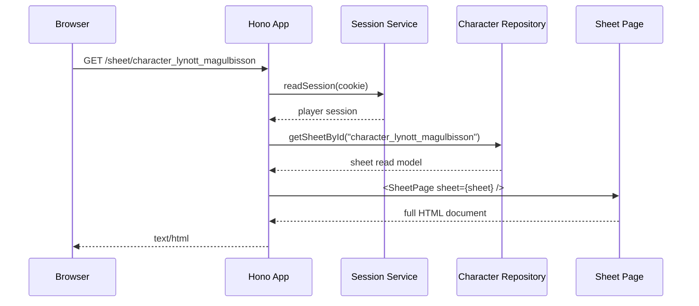
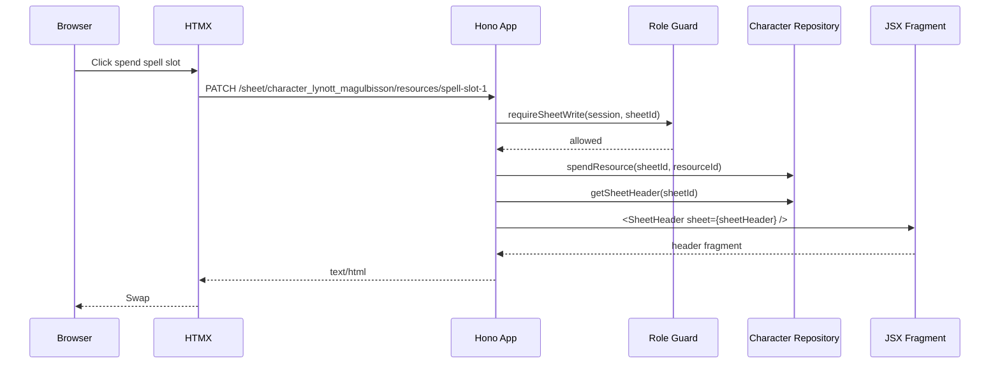
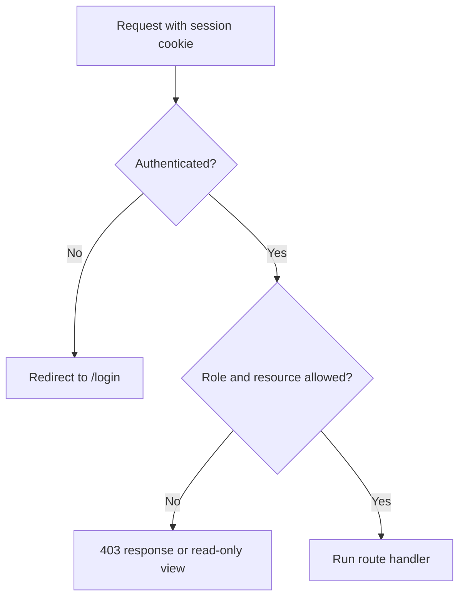
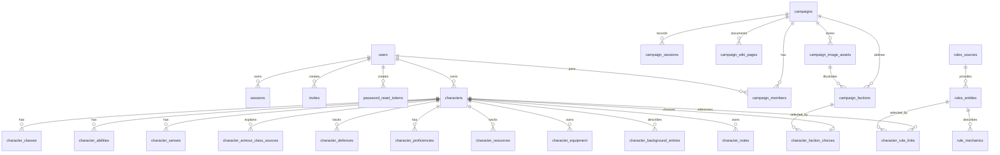
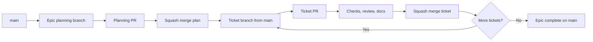

# Architecture

Character Sheet is a local-first D&D 5e sheet app built with Hono, HTMX, Bun, TypeScript, JSX, and SQLite.

The first MVP supports a seeded local workflow for Lynott Magulbisson, one Game Master, and one admin. It is intentionally designed as a server-rendered application, not a static markdown viewer: the database stores both durable character state and structured rules data, routes own mutation and permission checks, JSX components own semantic markup, and HTMX owns focused fragment swaps.

Deployment to Railway and a Postgres migration are out of scope for `sheet-0001`. The MVP should run locally with SQLite and keep the architecture compatible with a later database adapter.

## Goals

- Keep runtime setup separate from app construction.
- Use SQLite as the local source of truth for users, sheets, notes, mutable state, and structured rules data.
- Seed enough D&D 2014 rules data to support Lynott without importing the whole rules corpus.
- Normalise official 2014 material to the most recent 2014 reprint when sources overlap.
- Use British English in user-facing copy, code naming, and CSS custom properties.
- Enforce role-based access for player, Game Master, and admin flows.
- Render full pages and HTMX fragments from the same component tree.
- Keep persistence behind repository and service interfaces so a later Postgres epic does not rewrite route code.
- Use a TDD approach for repositories, services, routes, components, HTMX contracts, accessibility, and screenshots.

## Core Shape

The app follows the `pace-calculator` template. The full MVP source tree is expected to grow towards this shape as tickets land:

```text
src/
├── index.ts                    # Bun runtime entrypoint
├── app.tsx                     # Hono app factory
├── auth/                       # password, sessions, role guards
├── characters/                 # character read models, validation, services
├── rules/                      # rules import, normalisation, and read models
├── notes/                      # player and Game Master notes
├── db/                         # schema, repository contracts, SQLite implementation
├── components/                 # server-rendered JSX components
│   ├── atoms/
│   ├── molecules/
│   ├── organisms/
│   ├── pages/
│   ├── templates/
│   └── styles.ts
└── test/                       # shared app and repository harnesses
```

`src/index.ts` owns process setup: host and port environment variables, the SQLite filename, repository construction, auth/session service construction, seed/bootstrap wiring, and the Bun `fetch` export.

The runtime dependency boundary includes the app name, service contracts, and repository contracts:

```ts
export interface AppDependencies {
  appName: string;
  authRepository: AuthRepository;
  authService: AuthService;
  campaignRepository: CampaignRepository;
  characterRepository: CharacterRepository;
  notesRepository: NotesRepository;
  rulesRepository: RulesRepository;
  sessionService: SessionService;
}
```

Tests should use the same `createApp()` route tree. Route and repository tests should use in-memory SQLite repositories through that same dependency boundary.

## Request Flow

Initial page requests return a complete document:



HTMX interactions return the smallest meaningful fragment:



Routes that are triggered by HTMX should not return a full page unless the interaction needs a navigation-level response.

## Pages And Navigation

The MVP page set:

- `/` base home page for visitors and signed-in users; signed-in users get a role-aware continue link.
- `/login` login form using the shared site shell.
- `/logout` sign-out confirmation page using the shared site shell.
- `POST /logout` logout route that clears the session and redirects to `/`.
- `/campaigns/:campaignSlug` read-only Game Master campaign shell for the seeded campaign.
- `/sheet/:characterId` character sheet page.
- `/sheet/:characterId/tabs/:tabId` sheet tab panel fragment route for HTMX swaps.
- `PATCH /sheet/:characterId/notes/:noteId` seeded note save route that returns the notes tab panel.
- `/admin` admin shell with local invite creation.

The site header is sticky and contains:

- app name
- role-specific navigation menu
- colour mode toggle
- compact current user and role when signed in
- login or logout action

The sheet page has a second sticky header containing compact mobile-first identity and state:

- character name, species, class, and level as a concise identity line
- armour class
- hit points and temporary hit points, editable through a compact popover
- initiative
- speed
- conditions
- inspiration, editable through a resource-backed switch

Sheet content is arranged as scrollable tabs:

- core: abilities, saves, senses, speed, and defence
- skills, proficiencies, and training
- actions
- spellcasting
- features and traits
- equipment
- background
- notes

Each tab panel should be independently renderable, and tab navigation swaps only the active panel so the tab strip stays mounted and keeps its scroll position. Resource controls inside tab panels use the same route as the header controls, but request the active tab fragment back so tab-local resources can update without moving the sticky sheet chrome. Rest actions that can affect both header and tab resources return the full sheet tab workspace fragment.

The current tab navigation swaps only `#sheet-tab-panel`; the sticky `SheetHeader` and `SheetTabs` remain in place and client-side sync updates `aria-selected` after the panel settles. Rest actions still return the whole `#sheet-tab-workspace` because they can affect both the sheet header and tab-local resources.

## Roles And Permissions

The MVP has no more than ten users. It starts with four seeded users:

| Role | Initial user | Permissions |
| --- | --- | --- |
| Player | Lynott player | Read Lynott's sheet and update table-use state such as resources, conditions, equipment, rests, rolls, and their existing player note. |
| Player | Mira player | Seeded second player used to prove group roster, campaign membership, and faction-choice behaviour. |
| Game Master | Campaign GM | Read and update Lynott's sheet state and existing player/Game Master notes, plus view the seeded campaign shell. |
| Admin | Site admin | Access the admin shell, create local invite tokens, and use local password-reset token routes by known user id. |

Permission checks should live in shared guards, not scattered through components. Components may hide unavailable controls, but routes must enforce access. Campaign guards centralise membership checks, Game Master management checks, character ownership, and player-visible versus Game-Master-only campaign content.

Local authentication uses PBKDF2 password hashes, SQLite-backed sessions, and HTTP-only signed cookies. Seeded development users share the local-only password documented in `README.md`; production-grade password rotation and external identity providers remain out of scope for this MVP.



## Data Model

The database stores structured data for rules and sheet state. Markdown files in `docs/rules` are useful source material, but runtime reads should use SQLite read models. `bootstrapDatabase()` creates the MVP schema idempotently, `seedDatabase()` inserts local seed data, and repository interfaces keep route-facing contracts independent of SQLite.



### Core Tables

| Table | Purpose |
| --- | --- |
| `users` | Login identity, display name, role, password hash, and status. |
| `sessions` | Signed session records with expiry and user agent metadata. |
| `invites` | Admin or Game Master invite tokens for local account creation. |
| `password_reset_tokens` | Admin-triggered local password reset tokens. |
| `campaigns` | Campaign records owned by a Game Master. |
| `campaign_members` | User membership and role within a campaign. |
| `campaign_sessions` | Player-visible and Game-Master-only session records with title, slug, date, summary/body, author, and timestamps. |
| `campaign_wiki_pages` | Campaign wiki Markdown pages with page type, tags, source metadata, and visibility. |
| `campaign_image_assets` | App-managed image metadata with relative storage keys, dimensions, alt text, captions, and visibility. |
| `campaign_factions` | Rovnost faction records with player prompts, reputation, rumours, and optional asset links. |
| `characters` | Character identity, owner, campaign, campaign-unique slug, species, background, level, and summary stats. |
| `character_classes` | Class and subclass levels, hit dice, and spellcasting ability. |
| `character_abilities` | Ability scores, modifiers, saving throw proficiency, and derived save values. |
| `character_skills` | Skill ability, proficiency level, expertise, and derived values. |
| `character_senses` | Senses and passive scores used by the core sheet tab. |
| `character_armour_class_sources` | Armour class breakdown rows such as armour base, Dexterity bonus, and infusions. |
| `character_defences` | Resistances, immunities, condition immunities, and armour notes for the defence block. |
| `character_proficiencies` | Armour, weapon, tool, language, and training entries for the skills tab. |
| `character_resources` | Mutable resources such as hit points, hit dice, spell slots, inspiration, trait uses, and conditions. |
| `character_equipment` | Inventory, equipped items, attunement, and active item modifiers. |
| `character_background_entries` | Structured personality, backstory, false identities, NPCs, and rank structure rows for the background tab. |
| `character_notes` | Player-visible and Game Master-only notes. |
| `character_faction_choices` | One primary faction connection per character, constrained to the character's campaign. |
| `rules_sources` | Source metadata such as Tasha's Cauldron of Everything and source precedence. |
| `rules_entities` | Spells, class features, species traits, backgrounds, equipment, infusions, and conditions. |
| `rule_mechanics` | Structured mechanics such as uses, dice notation, DCs, ranges, durations, conditions, and scaling. |
| `character_rule_links` | Character selections and granted rules, such as prepared spells and known infusions. |

Some schema tables intentionally land before their full management UI. `sheet-0012` adds group-use read models for rosters, wiki pages, image assets, session records, factions, and faction choices while later tickets add creation/editing routes. Full character CRUD, campaign session CRUD, note creation, admin read tables, and richer rules text rendering are follow-up work.

### Rules Data

Rules import is local-first:

1. Read existing local markdown or JSON exports.
2. Parse metadata and text into structured rule entities.
3. Normalise spellings to British English.
4. Resolve source precedence for official 2014 rules and reprints.
5. Seed the local MVP corpus idempotently.
6. Keep enough source metadata to audit where each imported rule came from.

The importer lives behind `RulesImportService` and `RulesSeedRepository`, so live 5e.tools fetching can be added later without changing route code.

## Lynott MVP Coverage

The seed data must support Lynott as described in `docs/characters/Lynott-Magulbisson.md`:

- Level 4 hobgoblin Artillerist Artificer.
- Ability scores, saving throws, skills, senses, speed, armour class, hit points, and initiative.
- Artificer class features through level 4 and Artillerist features through level 4.
- Hobgoblin traits including Fey Gift and Fortune from the Many.
- Known and prepared spells needed by the sheet, including artificer and Artillerist spells.
- Known and active infusions, including Enhanced Defence and Repeating Shot.
- Equipment, false identities, background, NPCs, and notes.

## Component Model

Components are grouped by rendered responsibility:

- Atoms: primitive controls and outputs such as `Button`, `IconButton`, `Panel`, `Switch`, `Tab`, and `Badge`.
- Molecules: small compositions such as `FormField`, `LabelledOutput`, resource steppers, ability rows, note editors, and condition chips.
- Organisms: feature regions such as `SheetHeader`, `SheetTabs`, `SpellcastingPanel`, `ActionsPanel`, and `AdminUserTable`.
- Pages: full route compositions such as `HomePage`, `LoginPage`, `SheetPage`, and `AdminPage`.
- Templates: document shell, shared scripts, style injection, and layout slots.

Each component directory should colocate component code, styles, tests, and exports:

```text
components/organisms/SheetHeader/
├── SheetHeader.tsx
├── SheetHeader.styles.ts
├── SheetHeader.test.tsx
└── index.ts
```

The UI should be dense enough for repeated use at the table. Avoid marketing-style hero layouts, oversized decorative cards, and explanatory in-app copy. Controls should use appropriate form elements, labelled outputs, icons where useful, and stable dimensions so resource updates do not shift the page.

The current sheet shell follows that split: `SheetPage` composes route-level data, while `SiteHeader`, `SheetHeader`, `SheetTabs`, and `SheetTabPanel` are reusable component directories with colocated tests and styles.

## Testing Strategy

Development should be tests first where practical:

- Database tests create in-memory SQLite repositories and assert schema constraints, seed behaviour, and read models.
- Service tests cover password hashing, session handling, rule normalisation, source precedence, resource mutation, and permission decisions.
- Route tests call `app.request()` and assert status codes, redirects, session cookies, role enforcement, validation failures, full pages, and HTMX fragments.
- Component tests render JSX to strings and assert semantic HTML, labels, headings, ARIA, HTMX attributes, and empty states.
- Accessibility tests run Pa11y against key pages once a runnable app exists.
- Screenshot tests capture the sheet in light and dark states for user-facing UI changes.
- MVP smoke tests exercise seeded login, sheet navigation, resource mutation, note saving, role pages, and logout.

The minimum verification before a source-code ticket is complete:

```bash
bun run verify
```

The accessibility script currently checks public `/`, `/login`, authenticated `/sheet/lynott`, authenticated `/logout`, authenticated `/campaigns/rovnost-shadows`, and authenticated `/admin`. The MVP smoke script renders every sheet tab fragment directly. The screenshot script captures Lynott's sheet in light and dark mode to `docs/pr-screenshots/` by default.

## Pipeline

The repository uses a documentation-first ticket flow. Epic planning branches land the accepted roadmap documents on `main`; implementation ticket branches then start from the latest `main` and open pull requests back into `main`. A temporary integration branch can still be used for a deliberate stack, but it should be explicit and short-lived.



Release automation can be added after the MVP scaffold exists. Railway and Postgres deployment remain a later epic.

## Design Decisions

- Hono + HTMX + SQLite replaces the older GitHub Pages/localStorage plan.
- SQLite is the MVP source of truth for both mutable sheet state and structured rules data.
- Existing markdown remains useful as source material and human-readable reference, but runtime features should read structured tables.
- Local password auth is in scope now; external identity providers are not.
- Admin invite and password reset flows are local workflows without email delivery in this epic.
- Live 5e.tools fetching is deferred behind the importer boundary; local imports are available through `bun run import:rules`.
- Full group character management, campaign/session records, note creation, admin read tables, and deployment are deferred to later epics.
- British English is required across copy, docs, code naming, and CSS variables.
- The first implementation sequence is documentation and tickets, then source code through accepted tickets.
