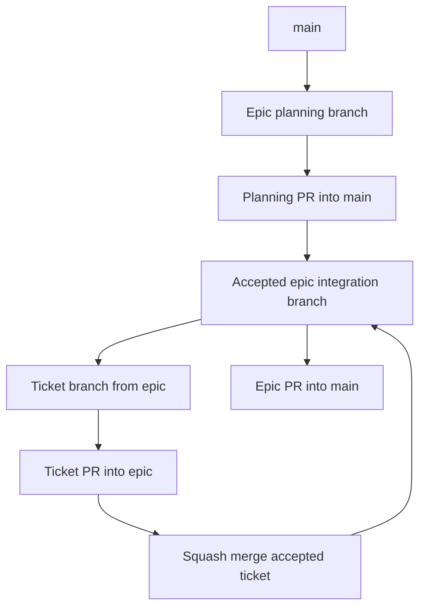

# Contributing

This repository uses a GitHub-tracked, documentation-first ticket workflow. `main` is the stable branch. Accepted epic plans are reviewed as their own pull requests into `main`; once accepted, implementation tickets branch from the active epic integration branch and open pull requests back into that epic branch. The epic branch is squash-merged into `main` after its ticket stack is accepted. GitHub Issues, issue-backed GitHub Project items, and PR checklist conventions are documented in [GitHub Workflow](./docs/operations/github-workflow.md) and [Project Tracking](./docs/project-tracking.md).

## Branch Flow

1. Create the epic planning branch from the latest `main`, for example `sheet-0011`.
2. Add or update the epic document and planned ticket documents.
3. Open the planning pull request into `main`.
4. After the plan is accepted, keep or recreate that branch as the epic integration branch.
5. Create each implementation ticket branch from the latest epic branch, for example `sheet-0012`.
6. Keep ticket work scoped to the current accepted ticket.
7. Write or update tests before source code wherever the boundary is testable.
8. Update every affected doc in the same pull request as the implementation change.
9. Run the required verification commands.
10. Open the ticket pull request into the epic branch.
11. Squash and merge the accepted ticket branch into the epic branch after review and checks.
12. When every ticket in the epic is accepted, open the epic branch pull request into `main`.

Do not rebase, reset, or discard commits on an existing branch unless the maintainer explicitly asks for it. Ticket branches should target the active epic branch while the epic is open, and the epic branch should be deleted after it lands on `main`.



## Epic And Ticket Flow

Epics and tickets share one numbering sequence:

- `sheet-0001` is the first epic.
- The first ticket generated from that epic is `sheet-0002`.
- Later epics continue the same pattern for their project prefix.
- Reserved roadmap blocks can be used when several future epics need unambiguous ordering. `sheet-0020` completed the SRD/rules slice; the current reserved blocks are `sheet-0030` for Railway deployment and `sheet-0040` for Hyper-Dank adoption.

The review loop is:

1. Generate the markdown from the accepted prompt or parent epic.
2. The maintainer reviews the document.
3. If accepted, update any affected docs and move to the next document.
4. If rejected, revise the document and repeat the review.

Implementation follows the accepted ticket documents. Every accepted ticket is implemented on its own ticket branch and squash-merged into the active epic branch. The epic branch is merged into `main` only after the epic is complete and accepted.

Historical epic documents live in `docs/epics/`. Historical ticket documents live in
`docs/tickets/`. New GitHub-managed work should start from a GitHub issue and Project item unless a
durable Markdown brief is needed for architecture, acceptance, or project memory.

## GitHub Issue And Project Flow

Create a GitHub Issue for each epic, implementation ticket, bug, and review follow-up using the
templates in `.github/ISSUE_TEMPLATE/`. Add the issue to the Campaign Ledger GitHub Project, use the
issue itself as the project item, and link ticket issues to parent epics with GitHub's native
parent/sub-issue relationship where possible. Keep the GitHub Project `Status`, `Base branch`,
`Branch`, `PR`, and `Verification` fields aligned with the work.

Pull requests should use `.github/PULL_REQUEST_TEMPLATE.md` and include the linked issue, project,
base branch, working branch, verification, screenshot evidence for user-facing UI changes, and
follow-up scope. Move issues to `Done` only after the PR is merged and acceptance evidence is
recorded.

## TDD Expectations

Use TDD where the implementation boundary can be exercised by tests:

- Repository and schema work starts with in-memory SQLite tests.
- Services and importers start with parser, normalisation, permission, and seed-data tests.
- Routes start with Hono `app.request()` tests for full-page responses, redirects, role permissions, validation errors, and HTMX fragments.
- Components start with JSX render tests for semantic HTML, labels, headings, ARIA, HTMX attributes, empty states, and errors.
- User-facing UI changes add accessibility checks and screenshots after lower-level tests pass.

Some documentation-only tickets may not have automated tests. In those cases, verify links, numbering, internal consistency, and British English. For source-code tickets, update README, architecture, ticket, or epic docs whenever the implementation changes behaviour, workflow, data shape, verification, or known follow-up scope.

## Conventional Commits

PR titles should follow this shape:

```text
type(optional-scope): short description
```

Common types:

- `feat`: user-facing capability
- `fix`: bug fix
- `docs`: documentation-only change
- `test`: test-only change
- `refactor`: behaviour-preserving implementation change
- `style`: formatting or presentation-only change
- `build`: dependency or build tooling change
- `ci`: workflow or repository automation change
- `chore`: maintenance that does not fit another type

Use `!` for breaking changes:

```text
feat!: replace repository contract
fix(auth): reject expired sessions
docs(sheet): add mvp data model
```

## Verification

For source-code tickets, run:

```bash
bun run verify
```

For narrower local debugging, the verification command is composed of:

```bash
bun run typecheck
bun run test
bun run test:a11y
bun run smoke:mvp
bun run screenshots:sheet
```

For user-facing UI work, review the light and dark screenshots generated in `docs/pr-screenshots/`.
The screenshot script also captures roster, campaign, wiki, faction, and edited-sheet states for group-use tickets.

The smoke workflow is the local acceptance pass for the group-use MVP. It covers player and Game Master character creation, manual sheet editing, resources, notes, faction selection, sessions, wiki reads and writes, image assets, admin invite/password-reset preparation, and protected logout behaviour.

For documentation-only work, check:

- Markdown links point to existing files.
- Ticket numbers are unique and sequential.
- Diagrams render as Mermaid.
- Public wording uses British English.
- New implementation guidance matches `ARCHITECTURE.md`.

## Branch Protection

`main` should be protected. A temporary integration branch should also be protected if the maintainer creates one for an active stack. Protection requires pull requests, one approval, resolved conversations, linear history, and no force pushes or branch deletions.

When the CI workflow is not present on a protected branch yet, use the bootstrap configuration:

```bash
bun run protect:branches:bootstrap
```

After the CI workflow has landed on the protected branches, use the full configuration so GitHub also requires the `test` status check:

```bash
bun run protect:branches
```

## British English

Use British English throughout the project:

- User-facing copy: `armour`, `defence`, `normalise`.
- Code names and database fields where natural: `armour_class`, `normaliseRuleText`.
- CSS custom properties: `--background-colour`, not `--background-color`.

External source names and quoted rules text may preserve official names where changing them would make a rule ambiguous.
