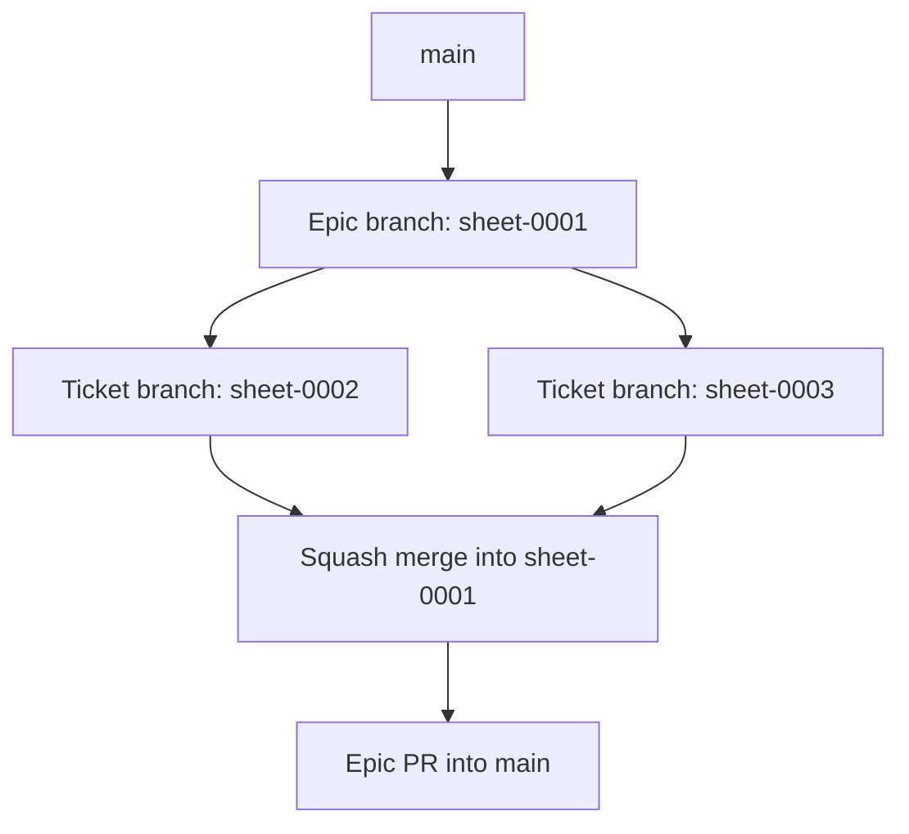

# Contributing

This repository uses a documentation-first, ticket-driven workflow. `main` is the stable branch. Each epic gets an integration branch, such as `sheet-0001`, and each ticket gets its own short-lived branch from that epic branch.

## Branch Flow

1. Create the epic branch from the latest `main`, for example `sheet-0001`.
2. Create each ticket branch from the current epic branch, for example `sheet-0002`.
3. Keep ticket work scoped to the current accepted ticket.
4. Write or update tests before source code wherever the boundary is testable.
5. Run the required verification commands.
6. Open the ticket pull request into the epic branch, not `main`.
7. Squash and merge the accepted ticket branch into the epic branch.
8. Repeat until all tickets for the epic are included.
9. Open the epic branch pull request into `main`.
10. Merge the epic branch only after the whole epic is accepted and checks pass.

Do not rebase, reset, or discard commits on an existing epic branch unless the maintainer explicitly asks for it.



## Epic And Ticket Flow

Epics and tickets share one numbering sequence:

- `sheet-0001` is the first epic.
- The first ticket generated from that epic is `sheet-0002`.
- Later epics continue the same pattern for their project prefix.

The review loop is:

1. Generate the markdown from the accepted prompt or parent epic.
2. The maintainer reviews the document.
3. If accepted, update any affected docs and move to the next document.
4. If rejected, revise the document and repeat the review.

Implementation follows the same branch structure: every accepted ticket is implemented on its own ticket branch and squash-merged into the active epic branch. The epic branch accumulates the reviewed ticket work and is merged to `main` as the complete epic.

Epic documents live in `docs/epics/`. Ticket documents live in `docs/tickets/`.

## TDD Expectations

Use TDD where the implementation boundary can be exercised by tests:

- Repository and schema work starts with in-memory SQLite tests.
- Services and importers start with parser, normalisation, permission, and seed-data tests.
- Routes start with Hono `app.request()` tests for full-page responses, redirects, role permissions, validation errors, and HTMX fragments.
- Components start with JSX render tests for semantic HTML, labels, headings, ARIA, HTMX attributes, empty states, and errors.
- User-facing UI changes add accessibility checks and screenshots after lower-level tests pass.

Some documentation-only tickets may not have automated tests. In those cases, verify links, numbering, internal consistency, and British English.

## Conventional Commits

PR titles should follow this shape:

```text
type(optional-scope): short description
```

Common types:

- `feat`: user-facing capability
- `fix`: bug fix
- `docs`: documentation-only change
- `test`: test-only change
- `refactor`: behaviour-preserving implementation change
- `style`: formatting or presentation-only change
- `build`: dependency or build tooling change
- `ci`: workflow or repository automation change
- `chore`: maintenance that does not fit another type

Use `!` for breaking changes:

```text
feat!: replace repository contract
fix(auth): reject expired sessions
docs(sheet): add mvp data model
```

## Verification

For source-code tickets, run:

```bash
bun run typecheck
bun run test
bun run test:a11y
```

For user-facing UI work, also capture screenshots once the screenshot script exists.

For documentation-only work, check:

- Markdown links point to existing files.
- Ticket numbers are unique and sequential.
- Diagrams render as Mermaid.
- Public wording uses British English.
- New implementation guidance matches `ARCHITECTURE.md`.

## British English

Use British English throughout the project:

- User-facing copy: `armour`, `defence`, `normalise`.
- Code names and database fields where natural: `armour_class`, `normaliseRuleText`.
- CSS custom properties: `--background-colour`, not `--background-color`.

External source names and quoted rules text may preserve official names where changing them would make a rule ambiguous.
