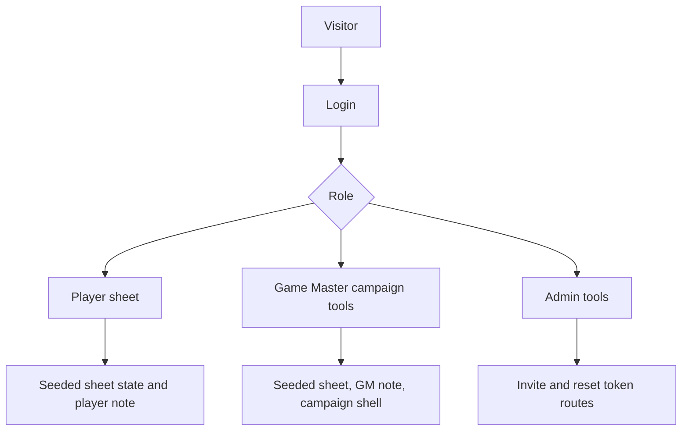
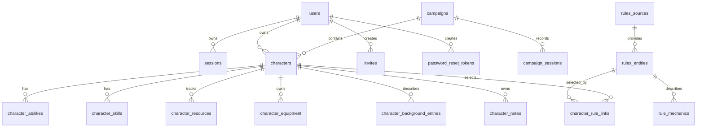
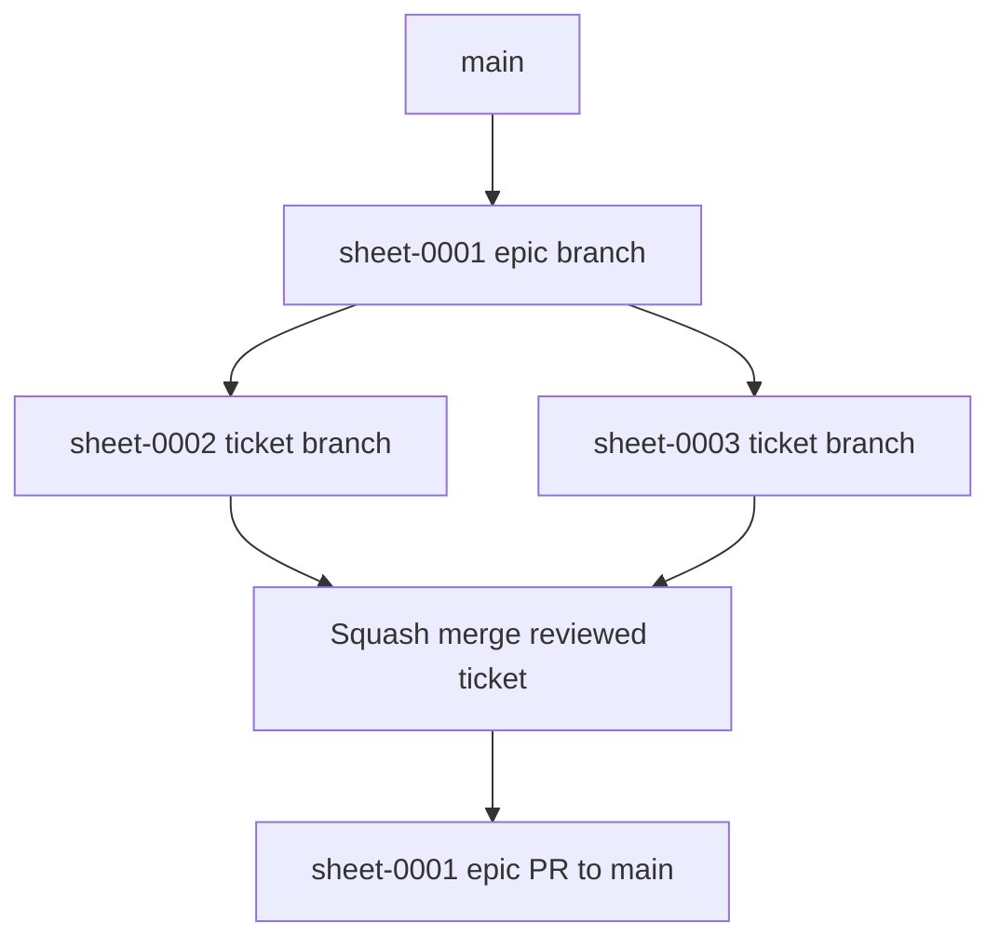

# Epic sheet-0001: Local Campaign Ledger MVP

## Summary

Build the first seeded local MVP of Campaign Ledger as a Hono + HTMX + SQLite application. The MVP should support Lynott Magulbisson as the first player character, one Game Master, and one admin. It should run locally, store structured sheet and rules data in SQLite, and use the `pace-calculator` app as the implementation template.

This epic replaces the earlier static GitHub Pages/localStorage architecture. Railway deployment and Postgres are deferred to the next epic.

## Goals

- Scaffold a Bun, Hono, HTMX, TypeScript, JSX, and SQLite app.
- Implement local password authentication, sessions, seeded users, admin invites, and admin-triggered password reset tokens.
- Store seeded character state, notes, equipment, spells, features, traits, and imported rules mechanics in SQLite.
- Seed enough D&D 2014 rules and character data to support Lynott.
- Render a usable character sheet with sticky site and sheet headers, compact resource controls, and scrollable tabs.
- Use British English in docs, code naming, database fields, CSS custom properties, and user-facing copy.
- Use TDD for repositories, services, routes, components, and HTMX fragment contracts wherever practical.

## Users And Permissions

| Role | MVP user | Permissions |
| --- | --- | --- |
| Player | Lynott player | Read Lynott's sheet and update table-use state such as resources, conditions, equipment, rests, rolls, and their existing player note. |
| Game Master | Campaign GM | Read and update Lynott's sheet state and existing player/Game Master notes, plus view the seeded campaign shell. |
| Admin | Site admin | Access the admin shell, create local invite tokens, and use local password-reset token routes by known user id. |

## Deferred Scope

The epic deliberately stops at a seeded local sheet MVP. Character creation and deletion, multiple player characters, campaign/session record management, note creation beyond seeded notes, admin user/read tables, richer runtime rules text from `rule_mechanics`, Railway deployment, and a Postgres adapter are follow-up work.

## Data Model

The database is the runtime source of truth. Existing markdown and local JSON exports are source material for seed/import scripts, not runtime state.

Core table groups:

- Auth and access: `users`, `sessions`, `invites`, `password_reset_tokens`.
- Campaign and play: `campaigns`, `campaign_members`, `campaign_sessions`.
- Character sheet: `characters`, `character_classes`, `character_abilities`, `character_skills`, `character_resources`, `character_equipment`, `character_background_entries`, `character_notes`.
- Rules: `rules_sources`, `rules_entities`, `rule_mechanics`, `character_rule_links`.

## Sheet Experience

The site header is sticky and includes the app name, current user identity and role, navigation, login, and logout.

The sheet page has a second sticky header with:

- character name, species, class, and level
- armour class
- hit points with current and temporary HP controls
- initiative
- conditions
- inspiration switch

The sheet body is tabbed and vertically scrollable:

- core: abilities, saves, senses, speed, and defence
- skills, proficiencies, languages, and tools
- actions
- spellcasting
- features and traits
- equipment
- background
- notes

## Ticket Map

| Ticket | Purpose |
| --- | --- |
| `sheet-0002` | Scaffold the Hono/HTMX/Bun application from the pace template. |
| `sheet-0003` | Add SQLite schema, repositories, migrations, and Lynott seed data. |
| `sheet-0004` | Add local password auth, sessions, seeded users, invites, and reset flows. |
| `sheet-0005` | Build the app shell, site header, sheet header, tabs, and responsive layout. |
| `sheet-0006` | Implement core, skills, proficiencies, speed, and defence tabs. |
| `sheet-0007` | Implement actions, spellcasting, features, traits, equipment, and resource tracking. |
| `sheet-0008` | Implement the background tab, seeded note editing, permissions, campaign shell, and admin shell. |
| `sheet-0009` | Add the local rules importer and British English normalisation. |
| `sheet-0010` | Complete accessibility, screenshots, documentation polish, and MVP acceptance checks. |

## Branch Strategy

`sheet-0001` is the epic integration branch. Each implementation ticket should branch from `sheet-0001`, open a pull request back into `sheet-0001`, and be squash-merged after review. When tickets `sheet-0002` through `sheet-0010` are complete, the accumulated `sheet-0001` branch opens the epic pull request into `main`.

## Acceptance Criteria

- The repository has current architecture, readme, contribution, epic, and ticket docs.
- Every implementation ticket states test-first expectations.
- The MVP architecture is aligned to the `pace-calculator` server-rendered template.
- The docs clearly defer Railway, Postgres, and live 5e.tools fetching to later work.
- Lynott's sheet, the Game Master, and the admin are explicitly covered.
- Deferred group-management and deployment features are named rather than implied as complete.
- British English expectations are documented.
