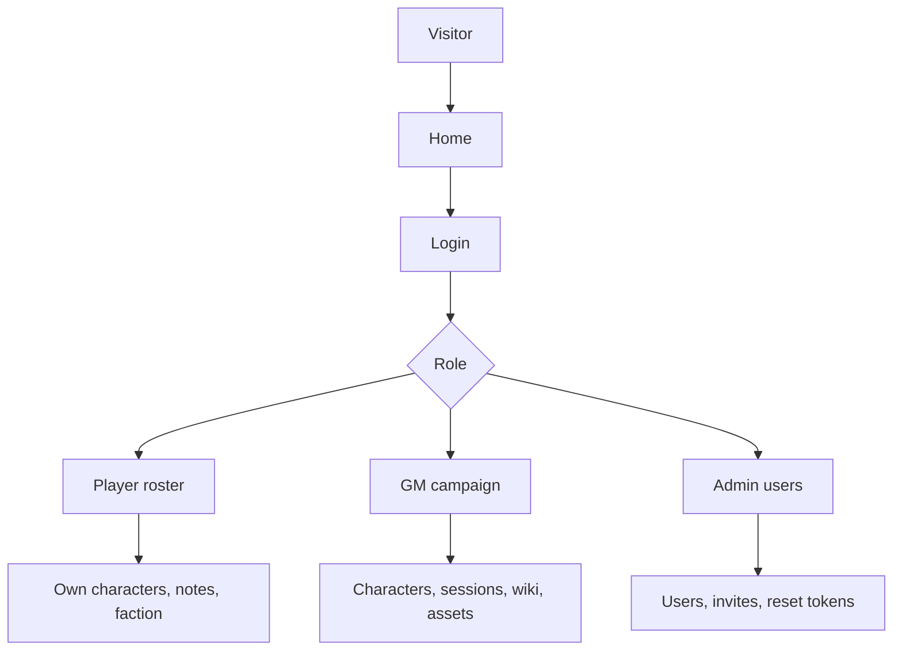

# Epic sheet-0011: Group-Use Campaign MVP

## Summary

Turn the seeded local sheet MVP into a usable local app for the current D&D group. The epic should keep the app local-first with SQLite, but expand it from Lynott-only play into multiple users, multiple characters, basic Game Master operations, campaign wiki material, image assets, and faction choices for the Rovnost campaign.

This epic prioritises getting the table running quickly. Railway deployment, Postgres, full SRD expansion, broad homebrew workflows, and the latest `pace-calculator` developer-experience tooling remain follow-up work.

The current `pace-calculator` baseline has landed its workspace split and release flow on `main` at `pace-calculator` 1.3.4, including private Hyper-Dank component, database, and HTTP packages with consumer compatibility coverage. Character Sheet should continue to follow those patterns during this epic, but it should not add runtime dependencies on the private workspace packages unless a ticket explicitly adds the consumption path and compatibility checks.

## Goals

- Support multiple player accounts and multiple characters in the seeded Rovnost campaign.
- Add local user management flows that let an admin or Game Master prepare accounts without email delivery.
- Add manual character creation and editing for the sheet fields the current UI can render.
- Add player and Game Master note creation, not only seeded note editing.
- Add Game Master campaign/session records for table prep and recap use.
- Add a campaign wiki that can import the current Google Docs Markdown exports.
- Add basic image asset support for maps, cover art, faction sigils, and NPC portraits.
- Add campaign factions and a Background tab faction picker.
- Keep unauthenticated access limited to the home page and future public rules pages.

## Non-Goals

- No Railway deployment, Postgres adapter, production secrets, or hosted file storage in this epic.
- No full guided character builder, levelling workflow, or automatic rules calculation.
- No full SRD 5.1 corpus import beyond what the current MVP already supports.
- No broad homebrew approval workflow beyond the campaign wiki, factions, notes, and manual character data needed for group play.
- No Storybook, Vite asset migration, or Playwright migration unless a ticket proves it is required for the group-use MVP.

## Users And Permissions

| Role | Group-use permissions |
| --- | --- |
| Unauthenticated visitor | View the home page only. |
| Player | Manage their own characters, notes, faction choice, and visible sheet state in campaigns where they are a member. |
| Game Master | Manage all campaign characters, notes, session records, wiki pages, factions, and campaign assets. |
| Admin | Manage local users, invites/reset tokens, account status, and read operational campaign metadata without bypassing play permissions by default. |

## Data And Interface Changes

Add or extend table groups for:

- Local account operations: user status, local account creation from invites, reset-token use, and admin read tables.
- Character roster: multiple characters per campaign and owner, unique slugs per campaign, manual identity/core editing, and ownership transfer by Game Masters.
- Notes and sessions: created notes with `player` or `game_master` visibility, authorship, timestamps, and campaign session records.
- Wiki and assets: campaign wiki pages with player-visible or Game Master-only visibility, imported Markdown bodies, tags, page types, and app-managed image assets with alt text, captions, dimensions, and visibility.
- Factions: campaign faction records, optional faction image asset, public reputation, player-facing prompts, rumours, and one primary faction connection per character.

Route groups should include:

- `/characters` for the signed-in player's roster and character creation.
- `/campaigns/:campaignSlug/characters` for Game Master roster management.
- `/sheet/:characterRef/edit/*` for manual sheet edits that return sheet or tab fragments.
- `/sheet/:characterRef/notes` for note creation and `/sheet/:characterRef/notes/:noteId` for note updates.
- `/campaigns/:campaignSlug/sessions` for Game Master session records.
- `/campaigns/:campaignSlug/wiki` and `/campaigns/:campaignSlug/wiki/:pageSlug` for wiki pages.
- `/campaigns/:campaignSlug/assets/:assetId` for protected campaign image assets.
- `/admin/users`, `/admin/invites`, and `/admin/password-reset-tokens` for local user operations.

Google Docs Markdown import should preserve the current player-facing source shape: title lines before headings, bold headings, horizontal rules, bullet lists, italic quotes, scene breaks, and generated heading outlines. Image paths from local machines must not be stored; uploads are copied into app-managed local storage.

Initial campaign source material includes the Rovnost blurb, factions guide, opening teaser, session zero kit, faction sigils, Magister Vallen portrait, Astril map, Shadows of Rovnost cover, and Skywright sigil.

## Ticket Map

| Ticket | Purpose |
| --- | --- |
| `sheet-0012` | Add group-use schema, repository, guard, and seed foundations. |
| `sheet-0013` | Add local user management, invite acceptance, reset use, and admin read tables. |
| `sheet-0014` | Add player and Game Master character rosters plus manual character creation. |
| `sheet-0015` | Add manual sheet editing for rendered character sections. |
| `sheet-0016` | Add note creation and Game Master campaign/session records. |
| `sheet-0017` | Add campaign wiki import and basic image asset support. |
| `sheet-0018` | Add Rovnost factions and the sheet Background faction picker. |
| `sheet-0019` | Complete group-use verification, accessibility, screenshots, and documentation. |

## Branch Strategy

`sheet-0011` landed as the accepted planning pull request into `main`, so there is no live remote integration branch for this epic. Each implementation ticket branch should branch from the latest `main`, open a pull request back into `main`, and be squash-merged after review and checks.

If the maintainer deliberately restores a temporary integration branch for this epic, ticket branches should target that branch until it lands. Otherwise, `main` is the base for `sheet-0012` through `sheet-0019`.

## Test And Verification Strategy

- Repository tests cover user management, campaign membership, roster queries, character editing, notes, sessions, wiki pages, image metadata, and faction selection.
- Route tests cover role permissions, unauthenticated redirects, validation failures, full pages, and HTMX fragments.
- Component tests cover roster pages, edit forms, note/session forms, wiki pages, asset cards, faction cards, and Background tab faction controls.
- Importer tests use fixtures modelled on the Rovnost Google Docs Markdown exports.
- Accessibility and screenshot checks cover player roster, GM campaign, admin users, wiki page with images, faction page, and Background tab faction selection.
- `bun run verify` remains the acceptance command for source-code tickets.
- Each ticket updates affected README, architecture, epic, or ticket docs in the same pull request as the implementation.

## Acceptance Criteria

- A fresh local checkout can seed and run a usable small-group campaign workflow.
- Players can sign in, see their roster, create at least one character, edit rendered sheet fields, create notes, and select a faction.
- Game Masters can manage campaign characters, notes, session records, wiki pages, assets, and factions.
- Admins can manage local users/invites/resets without gaining sheet play-edit access by default.
- The Rovnost player-facing Markdown and images can be represented in the campaign wiki with correct visibility and alt text.
- README and architecture docs state what is delivered and what is deferred to deployment and broader content epics.
