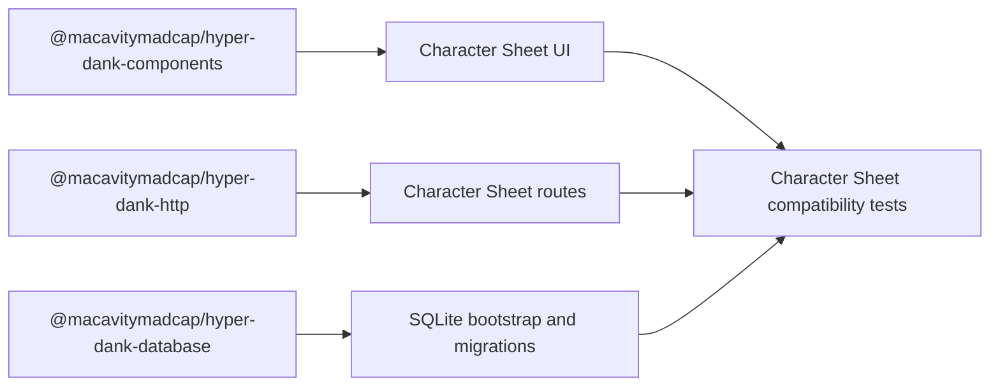

# Epic sheet-0020: Hyper-Dank Platform Adoption

## Summary

Adopt the deployed Hyper-Dank `1.4.4` package contract in Character Sheet so this app consumes
shared platform primitives through public package imports instead of continuing to copy template
code by hand.

This epic follows the accepted group-use MVP epic (`sheet-0011`). It is a platform-alignment epic,
not a new gameplay or campaign-content epic. Character Sheet should adopt only the parts of
Hyper-Dank that are already app-agnostic and documented: shared components, shared HTTP helpers,
and database migration primitives where they fit the local SQLite boundary. Character Sheet keeps
ownership of D&D domain language, rules import, campaign permissions, route design, schema shape,
seed data, and local-first workflow decisions.

The source-of-truth baseline is the deployed Hyper-Dank `main` release line through
`pace-calculator-v1.4.4`, including the public docs site, component package docs, Character Sheet
consumer compatibility smoke test, and the newer `pace-0031` roadmap for broader reusable
primitives.

## Goals

- Consume `@macavitymadcap/hyper-dank-components` for generic atoms and molecules that already match
  Character Sheet usage.
- Consume `@macavitymadcap/hyper-dank-http` for reusable form parsing and response helpers where the
  behaviour stays equivalent.
- Evaluate `@macavitymadcap/hyper-dank-database` for migration bookkeeping and helper boundaries
  without moving Character Sheet schema ownership out of this repository.
- Add Character Sheet-side compatibility coverage that exercises Hyper-Dank packages through their
  public import paths.
- Align README, architecture, contribution docs, and verification around the shared-package
  boundary so future Hyper-Dank updates are easier to adopt safely.

## Non-Goals

- No new player, Game Master, admin, rules, or campaign features.
- No Railway deployment, Postgres migration, hosted asset storage, or production secret work in
  this epic.
- No move into the Hyper-Dank monorepo and no runtime dependency on Walking Pace app code.
- No forced adoption of Hyper-Dank primitives that are still only planned in `pace-0031`.
- No package rename work in Character Sheet during this epic; if Hyper-Dank later renames package
  identities, that should land as a follow-up compatibility ticket after the upstream break is
  released.

## Platform Boundary

Shared packages should stay generic. Character Sheet keeps:

- route paths, redirects, and HTMX fragment contracts
- auth, sessions, guards, and campaign permissions
- SQLite table definitions, seeds, and D&D-specific repositories
- game terminology, British English copy, and sheet-specific composition

Where Hyper-Dank is still missing a needed primitive, prefer a small local adapter or a documented
upstream follow-up rather than stretching Character Sheet around the wrong abstraction.

## Interface And Workflow Changes

- Add package dependencies on `@macavitymadcap/hyper-dank-components`,
  `@macavitymadcap/hyper-dank-http`, and optionally `@macavitymadcap/hyper-dank-database` once the
  install path is fixed for this repo.
- Import `@macavitymadcap/hyper-dank-components/styles.css` through the browser asset pipeline while
  preserving local app styling and theme tokens on top.
- Replace local generic components only where Hyper-Dank already provides an equivalent public API:
  `Badge`, `Button`, `CompactList`, `FormField`, `Icon`, `Panel`, `PopoverMenu`, and `Switch` are
  the first expected candidates because they are already covered by the upstream Character Sheet
  compatibility smoke test.
- Evaluate newer Hyper-Dank primitives added after `1.4.4`, but keep them out of scope unless they
  materially reduce Character Sheet duplication without dragging in Walking Pace assumptions.
- Add a Character Sheet compatibility command, expected as `bun run test:compat`, that validates
  public package imports from this repo.
- Extend `bun run verify` to include the compatibility gate once the workflow is stable.

## Ticket Map

| Ticket | Purpose |
| --- | --- |
| `sheet-0021` | Add Hyper-Dank package installation, shared stylesheet wiring, and Character Sheet compatibility test scaffolding. |
| `sheet-0022` | Migrate existing generic atoms and molecules to `@macavitymadcap/hyper-dank-components`. |
| `sheet-0023` | Adopt `@macavitymadcap/hyper-dank-http` for generic form parsing, validation helpers, and response helpers. |
| `sheet-0024` | Evaluate and adopt `@macavitymadcap/hyper-dank-database` only where it improves local migration/bootstrap boundaries. |
| `sheet-0025` | Expand compatibility, accessibility, and screenshot coverage around the shared-component migration. |
| `sheet-0026` | Update docs, verification flow, and final acceptance notes for the Hyper-Dank consumer workflow. |

## Branch Strategy

Create `sheet-0020` from the latest `main` after the `sheet-0011` epic lands. Open the planning
pull request into `main`. Once accepted, keep or recreate `sheet-0020` as the epic integration
branch. Tickets `sheet-0021` through `sheet-0026` should branch from `sheet-0020`, open pull
requests back into `sheet-0020`, and be squash-merged there before the epic lands on `main`.

## Test And Verification Strategy

- Component tests prove the Hyper-Dank replacements preserve Character Sheet semantics, labels,
  ARIA attributes, HTMX attributes, and compact mobile rendering.
- Route tests confirm shared HTTP helpers do not change redirect behaviour, error handling, status
  codes, or fragment responses.
- Repository and schema tests protect any database-helper adoption and keep bootstrap plus seed
  flows idempotent.
- Compatibility tests import only public Hyper-Dank package names and render representative
  Character Sheet usage.
- Accessibility and screenshot checks compare key Character Sheet surfaces before and after the
  shared-component migration.
- `bun run verify` remains the source-code acceptance command after the compatibility gate is added.

## Risks And Assumptions

- Hyper-Dank `1.4.4` is treated as the stable starting contract, but `pace-0031` shows broader
  upstream primitives are still evolving; this epic should adopt only released, documented
  contracts.
- Character Sheet may need a repeatable local package-install strategy such as tarball packs or
  workspace linking; `sheet-0021` should pick one documented path and keep it easy to rerun.
- Upstream shared components may still need additive props for full Character Sheet adoption.
  Prefer upstream contract extensions with compatibility tests over local forks.
- The database package may remain a partial fit until the later Postgres epic. If so, document the
  choice and keep local bootstrap code.

## Acceptance Criteria

- Character Sheet consumes stable Hyper-Dank package APIs through public import paths.
- Generic UI primitives are shared where that reduces duplication, while sheet-specific composition
  remains local.
- Verification catches both Character Sheet regressions and Hyper-Dank package-contract breakage.
- README, architecture, and contribution docs explain the shared-package boundary clearly.
- The current group-use workflow still passes tests, accessibility checks, smoke coverage, and
  screenshots after the platform adoption work lands.
