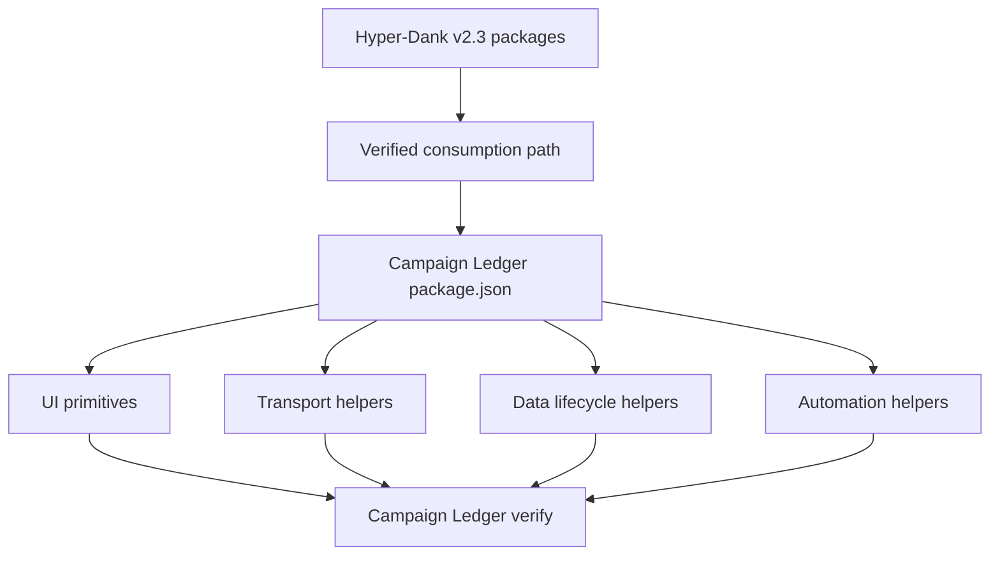

# Epic sheet-0040: Hyper-Dank Package Adoption

## Summary

Adopt the current Hyper-Dank package layer before the next large Campaign Ledger product epic. The
goal is to reduce app-local framework code, align Campaign Ledger with the reusable Hyper-Dank
contracts, and make later Game Master prep work build on shared UI, transport, data, and automation
primitives instead of copying more local scaffolding.

Hyper-Dank has moved beyond the earlier `pace-calculator` template reference. The current local
framework repo is `hyper-dank` at `hyper-dank-v2.3.0`, with reusable packages named
`@macavitymadcap/hyper-dank-ui`, `@macavitymadcap/hyper-dank-data`,
`@macavitymadcap/hyper-dank-transport`, and `@macavitymadcap/hyper-dank-automation`. Those packages
are covered by consumer-style compatibility tests in Hyper-Dank, but they are not published on npm
as of 2026-05-21. Campaign Ledger should therefore adopt them through the verified consumption path
from Hyper-Dank's `pace-0060` installability work, using local tarballs or a GitHub route until
registry publication exists.

## Goals

- Add Hyper-Dank packages to Campaign Ledger through a repeatable, documented consumption path.
- Replace local generic UI atoms and molecules with `@macavitymadcap/hyper-dank-ui` where the public
  component contracts match Campaign Ledger's needs.
- Keep Campaign Ledger-specific organisms, pages, sheet controls, dice controls, domain copy, and
  campaign layouts in this app.
- Replace app-local form parsing, route parameter, HTMX redirect, and fragment/page helpers with
  `@macavitymadcap/hyper-dank-transport` where useful.
- Adopt `@macavitymadcap/hyper-dank-data` for migration planning or provider lifecycle boundaries
  without forcing a Postgres migration.
- Adopt `@macavitymadcap/hyper-dank-automation` for verification, local server readiness, Pa11y, PR
  screenshot helpers, and GitHub helper code where it reduces local script duplication.
- Add a Campaign Ledger compatibility check that imports Hyper-Dank through public package paths.
- Update README, architecture, and ticket workflow docs so Hyper-Dank packages are runtime
  dependencies rather than only a pattern reference.

## Non-Goals

- No broad redesign of Campaign Ledger surfaces.
- No Postgres migration or production database re-architecture.
- No Better Auth migration in this epic; Campaign Ledger's current local auth remains app-owned.
- No automatic migration of domain repositories into Hyper-Dank.
- No adoption of unpublished npm packages as if they were registry-stable.
- No GM prep, private NPC, Google Docs import, or reveal-workflow implementation; that follows this
  epic.

## Current Hyper-Dank State

Local inspection on 2026-05-21 found:

- Hyper-Dank root package version: `2.3.0`.
- Latest local release tag: `hyper-dank-v2.3.0`.
- Reusable packages:
  - `@macavitymadcap/hyper-dank-ui`
  - `@macavitymadcap/hyper-dank-data`
  - `@macavitymadcap/hyper-dank-transport`
  - `@macavitymadcap/hyper-dank-automation`
- Package export maps expose source for Bun/workspace consumers and declaration files from `dist`.
- `bun run test:compat` in Hyper-Dank packs local workspace packages and runs consumer-style app
  shape tests through public package names.
- `npm view` returned `404 Not Found` for all four package names, so npm publication must not be a
  Campaign Ledger assumption yet.
- Hyper-Dank's active `pace-0060` epic is making consumer docs, Storybook, package READMEs, and
  installation guidance persuasive. Campaign Ledger adoption should track that installability work
  instead of inventing a separate package-consumption story.

## Adoption Map

| Campaign Ledger area | Hyper-Dank package | Adoption posture |
| --- | --- | --- |
| `Badge`, `Button`, `Panel`, `Switch`, `Accordion`, `CompactList`, `FormField`, `LabelledOutput`, `PopoverMenu` | `@macavitymadcap/hyper-dank-ui` | Replace local generic components when markup/CSS hooks are compatible; keep domain-specific wrappers local. |
| `Icon`, `PasswordField`, `DiceRoller`, `SiteHeader`, sheet tabs/header | App-owned or selective UI adoption | Keep local unless Hyper-Dank exposes a matching public component without Campaign Ledger assumptions. |
| Route body parsing, route params, HTMX detection, redirects, fragment/page response selection | `@macavitymadcap/hyper-dank-transport` | Adopt helper-by-helper behind route tests. |
| SQLite bootstrap and migrations | `@macavitymadcap/hyper-dank-data` | Use migration planning/lifecycle primitives where they reduce local code; keep schemas and repositories app-owned. |
| `scripts/lib/local-app.ts`, Pa11y runner, screenshot flow helpers, verification runner, GitHub helpers | `@macavitymadcap/hyper-dank-automation` | Replace local mechanics while preserving Campaign Ledger targets and smoke workflows. |
| Public docs and workflow | Hyper-Dank docs/recipes | Update Campaign Ledger docs to reference current package names and consumption boundaries. |

## Key Workflows

- A developer can install or consume the required Hyper-Dank packages in Campaign Ledger using the
  documented route, then run `bun install` and `bun run verify`.
- A component migration ticket replaces a small set of generic local components with Hyper-Dank UI
  imports, keeps visible Campaign Ledger styling intact, and removes dead local files.
- A route-helper ticket replaces duplicated request/HTMX mechanics without changing permissions,
  validation, redirects, or fragment contracts.
- A script-helper ticket adopts Hyper-Dank automation while preserving existing Campaign Ledger
  verification order, screenshots, Pa11y targets, and local smoke coverage.
- A compatibility check proves Campaign Ledger imports Hyper-Dank through public package paths, not
  private monorepo source paths.

## Ticket Map

| Ticket | Purpose |
| --- | --- |
| `sheet-0041` | Verify Hyper-Dank package consumption route and add Campaign Ledger dependency/compatibility foundations. |
| `sheet-0042` | Adopt Hyper-Dank UI primitives for generic atoms and low-risk molecules. |
| `sheet-0043` | Adopt Hyper-Dank transport helpers for form values, route params, HTMX detection, redirects, and fragment/page responses. |
| `sheet-0044` | Adopt Hyper-Dank data lifecycle and migration-planning helpers where they fit SQLite without changing repositories. |
| `sheet-0045` | Adopt Hyper-Dank automation helpers for verification, local server readiness, Pa11y, screenshots, and GitHub utilities. |
| `sheet-0046` | Remove replaced local framework code, update imports, docs, and architecture diagrams. |
| `sheet-0047` | Complete compatibility, screenshot, accessibility, and acceptance checks for Hyper-Dank adoption. |

## Branch Strategy

Create `sheet-0040` from the latest accepted `main` after `sheet-0050` lands or from the active
`sheet-0050` integration branch if adoption must begin before the full product epic is merged. Open
the planning pull request into the chosen base. Once accepted, keep or recreate `sheet-0040` as the
epic integration branch. Tickets `sheet-0041` through `sheet-0047` should branch from `sheet-0040`,
open pull requests back into `sheet-0040`, and be squash-merged there before the accumulated epic
branch targets `main`.

`sheet-0061` Game Master prep should start after `sheet-0040` unless a narrow discovery ticket needs
to run in parallel without adding new framework surface area.

## Test And Verification Strategy

- Add or update compatibility tests that import Hyper-Dank packages through public package names.
- Run the selected Hyper-Dank package consumption command before implementing migration tickets.
- Component tests prove migrated UI primitives preserve semantic output, HTMX attributes, class
  hooks, and accessible names.
- Route tests prove transport-helper adoption preserves redirects, errors, HTMX fragments, and
  permissions.
- Database tests prove migration/lifecycle helper adoption remains idempotent against in-memory and
  file-backed SQLite.
- Script tests prove verification, Pa11y, screenshots, and smoke targets keep the same coverage.
- Screenshot and accessibility checks cover the visible surfaces touched by component migration.
- `bun run verify` remains the final Campaign Ledger acceptance command.

## Risks And Assumptions

- Hyper-Dank packages are not npm-published today, so Campaign Ledger needs an explicit local
  tarball, GitHub, or workspace-style installation route until publication exists.
- The shared UI package is generic by design. If a Campaign Ledger component carries domain logic,
  it should stay local.
- CSS contracts may differ even where component names match. Migration tickets should preserve the
  current table-use UX rather than taking a visual reset.
- Automation helpers should reduce local script mechanics, not hide Campaign Ledger's smoke and
  screenshot target definitions.
- Adopting data helpers should not become an accidental Postgres or auth-provider migration.

## Acceptance Criteria

- Campaign Ledger consumes the current Hyper-Dank packages through a documented, verified route.
- Local generic framework components and scripts are reduced where Hyper-Dank public contracts fit.
- Domain-specific Campaign Ledger pages, sheet controls, campaign flows, auth, schemas, and
  repositories remain app-owned.
- Compatibility coverage protects the public Hyper-Dank import paths used by Campaign Ledger.
- README and architecture docs refer to the current Hyper-Dank package names and adoption boundary.
- `bun run verify` passes after all migrations.
