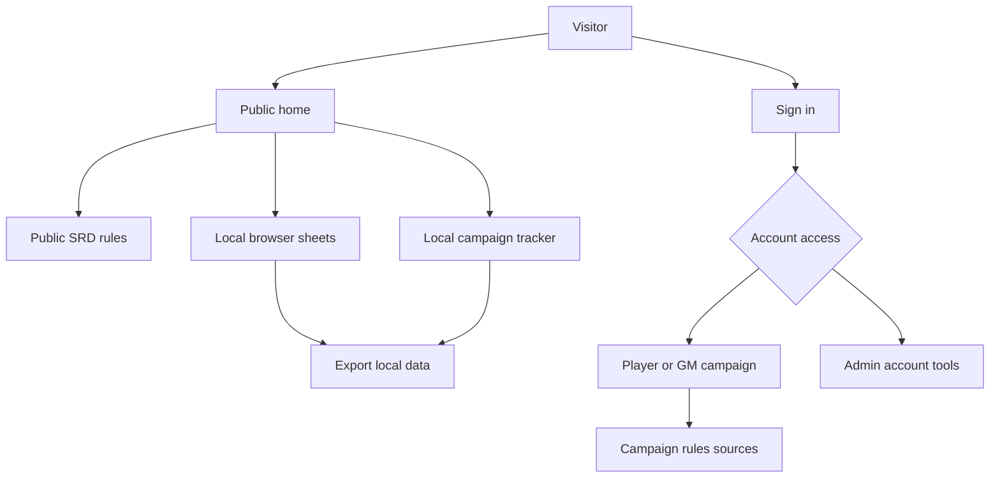
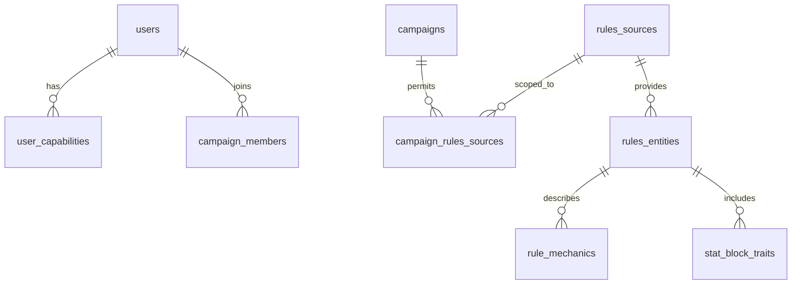

# Epic sheet-0050: Campaign Companion, Public Play, And Rules Content

## Summary

Evolve Campaign Ledger from a hosted character-sheet rehearsal into a broader campaign companion for
Rovnost table play. The epic should make public SRD rules and local browser-backed play tools useful
without sign-in, improve admin account handoff, support admin access alongside player or Game Master
membership, and fill the most obvious rules and seeded-character gaps.

This is a product and content epic, not a platform-adoption epic. `sheet-0040` remains reserved for
Hyper-Dank package adoption. Railway, SQLite, Hono, HTMX, and the current local-first import model
remain the baseline.

## Goals

- Make SRD rules publicly browseable because SRD 5.1 content is safe to expose without sign-in.
- Add public local-storage character and campaign tracking with export and import so visitors can
  use the app before they have an account.
- Improve the home page so it explains the signed-in and public workflows and links directly to
  rules, sheets, and campaigns.
- Replace janky invite and password-reset handoff with admin UI that generates complete links and
  supports safer password entry.
- Allow admin access to coexist with player or Game Master campaign participation.
- Add campaign-scoped rules sources so Rovnost can include private local sources without
  mislabelling them as SRD or exposing them publicly.
- Make campaign image asset state obvious so Game Masters can tell whether images are seeded,
  uploaded, missing, or represented by a fallback.
- Fill imported rules detail enough that searches such as Bless find readable rules in a fresh
  seeded or imported database.
- Ensure admin, player, Game Master, and public rules views all read the accepted SRD import rather
  than a sparse Lynott-only starter corpus.
- Add stat block support where the local source corpus provides it.
- Flesh out Mira's sheet data, including spells, class features, actions, and Eldritch Cannon bonus
  action handling where relevant.
- Improve compact table-use layout for admin, campaign, rules, and roll popover surfaces.
- Rename the app from its former "Character Sheet" identity to "Campaign Ledger" across package, docs, app chrome,
  deployment copy, local folder references, and GitHub repository references.

## Non-Goals

- No production email delivery, external identity provider, or automatic invite sending.
- No hosted commercial rules corpus, public redistribution of owned non-SRD material, or live
  fetching from external rules sites.
- No full guided character builder, levelling engine, or automatic class/species/background grant
  engine.
- No Postgres migration or broader deployment re-architecture.
- No Hyper-Dank package migration; that stays in `sheet-0040`.
- No complete visual redesign of the sheet page outside the compact surfaces named in this epic.

## Users And Permissions

| Actor | Epic behaviour |
| --- | --- |
| Public visitor | Can read SRD rules, create local browser-only characters/campaign notes, and export or import that local data. |
| Player | Keeps current roster and sheet access, with richer rule detail and seeded character data. |
| Game Master | Keeps campaign management access and can attach additional campaign-scoped rules sources where permitted. |
| Admin | Can manage accounts, invite links, reset links, and account status without losing player or Game Master campaign membership. |

## Key Workflows

- A visitor opens `/`, understands that SRD rules are public, and can continue to public rules,
  public local sheets, or public local campaign tracking without signing in.
- A visitor tracks a local character or campaign in browser storage, then exports a portable JSON
  file and can later import it into the same browser or another device.
- An admin opens the admin account screen, selects a user or invite, generates a full invite or
  reset URL, copies the URL from the page, and can see token status without reading raw JSON.
- A user resetting a password enters the new password twice or uses a show-password control before
  submitting. Login also supports show-password.
- A signed-in admin who is also a player or Game Master can see both admin tools and relevant
  campaign navigation without the single-role model blocking play access.
- A Game Master imports or attaches campaign-scoped private rules sources for Rovnost. Public users
  never see those sources, and SRD/local/private provenance remains visible in rules UI.
- An admin opens rules and sees the same complete SRD-backed rule catalogue as other permitted
  users, not a role-specific empty or Lynott-only subset.
- A Game Master opens campaign image management and can see whether each expected map, cover,
  portrait, or sigil is present, missing, uploaded, or using a fallback.
- A player opens Mira's sheet and sees credible spells, features, resources, and actions rather than
  an obviously partial seed.
- A player opens features, traits, spells, or equipment and gets compact disclosure sections where
  the summary is the rule name and the body contains readable rule text, source metadata, resource
  controls, action timing, and reset cadence where known.

## Current UX Review Findings

- `P2` The home page does not yet explain the app's real scope. It still presents the product through
  the old sheet-only framing for Lynott, the Game Master, and admin, then offers signed-out users only a
  sign-in path. `sheet-0052` should make public rules, local browser sheets, local campaign
  tracking, and signed-in campaign tools clear from the first screen.
- `P2` Admin account handoff is still operator-hostile. The admin screen can create invites and
  reset tokens, but the page does not surface complete invite/reset URLs, token copy affordances, or
  enough user-readable token context; the tables are also hard to scan on mobile. `sheet-0054`
  should make invite/reset handoff a complete UI workflow, and `sheet-0059` should compact the
  admin tables.
- `P2` Password setup screens are too easy to mistype on. Login, invite acceptance, and password
  reset currently use single password fields without confirmation or show-password controls.
  `sheet-0054` should add humane password confirmation/visibility patterns without weakening
  server-side validation.
- `P2` The Game Master campaign page combines overview, wiki browsing, image upload, image gallery,
  wiki creation, session creation, and session editing in one long management surface. This makes
  the page difficult to scan and forces unrelated tasks to compete for attention. `sheet-0037` or
  `sheet-0059` should split or compact these management surfaces before more campaign content is
  added.
- `P2` Campaign image state is not legible enough. Existing screenshots show large blank or fallback
  image regions, while the current form asks for manual dimensions and does not tell the Game Master
  whether an image is seeded, uploaded, missing, protected, or using a fallback. `sheet-0059` should
  add explicit asset status and more humane image management.
- `P2` Sheet actions are not yet character-specific enough. The Actions tab uses shared standard
  action and bonus/reaction lists, so class-specific entries such as Eldritch Cannon can appear as
  generic table actions instead of being driven by the current character's rule links/resources.
  `sheet-0057` and `sheet-0058` should move actions, bonus actions, reactions, and reset cadence
  behind character-specific rules/mechanics data.
- `P2` Feature and spell disclosures exist, but they do not yet contain full playable rule text.
  Current sheet accordions mostly show selection/source metadata, slot spending, and resource uses;
  players still need to leave the sheet for the complete rule. `sheet-0057` should render full rule
  text, action timing, resource tracking, and reset cadence inline where the data exists.
- `P2` The player and Game Master rosters still rely on horizontally scrolling tables on narrow
  screens, which hides columns and breaks labels such as "Level". `sheet-0059` should provide a
  compact card/list presentation for roster-style data on mobile.
- `P2` Sheet data tables can squash their action controls on narrow or constrained widths. The Core
  abilities table shows d20 and edit buttons squeezed into the Actions column, which makes repeated
  play controls harder to hit and scan. `sheet-0059` should give ability, skill, proficiency, and
  similar sheet rows stable responsive layouts for roll/edit actions.
- `P2` Inline `details` edit forms are too cramped for sheet rows and compact cards. Editing a
  value such as Passive Perception opens a small disclosure inside the display tile, which squeezes
  labels, inputs, and actions into the read layout. `sheet-0059` should replace these disclosures
  with HTMX edit-state swaps where the row/card itself becomes the edit form, then submit or cancel
  swaps back to the read state.
- `P3` The roll popover works and now positions predictably, but it visually reads like another
  sheet panel and is easy to lose against the background. `sheet-0059` should give roll popovers a
  distinct treatment and preserve the result close to the triggering roll.
- `P3` Rules browsing is readable for simple SRD entries such as Bless, but the filter panel remains
  heavy relative to the result/detail content on mobile and the current accepted screenshots only
  prove a small imported fixture path. `sheet-0052` and `sheet-0057` should keep rules public,
  source-aware, and useful with the full accepted import.

## Interfaces And Data Changes

- Keep `/rules` and `/rules/:entityType/:slug`, but allow public reads for SRD rules.
- Add public local-play routes, expected as `/local/characters`, `/local/campaigns`, and export or
  import endpoints or browser-only form actions that do not write server state.
- Keep authenticated `/characters`, `/campaigns/:campaignSlug`, `/sheet/:characterRef`, and
  `/admin` routes for server-backed data.
- Extend account access from a single `users.role` value towards explicit capabilities or
  memberships, while preserving compatibility for existing seeded users and guards.
- Extend rules source metadata so each source has content category, visibility, campaign scope,
  import provenance, and public-export eligibility.
- Extend rules entities to include stat blocks and richer detail rendering where local files provide
  enough data.
- Extend rule mechanics/resource metadata enough to represent reset cadence such as long rest, short
  rest, daily, dawn, charges, action, bonus action, reaction, and passive traits.
- Treat local-storage public data as a versioned client-side document, not as a shadow copy of the
  SQLite schema.

## Content And Source Policy

- SRD 5.1 content may be public and exported from the public local-play experience with required
  attribution preserved.
- Existing Artificer, Hobgoblin, Rovnost, and other non-SRD source material must remain categorised
  as local or private, not SRD.
- Owned non-SRD rules can be imported for the local Rovnost campaign only when the source is marked
  private/campaign-scoped and is excluded from public routes, screenshots, repository fixtures, and
  public local-data exports unless explicitly allowed.
- The app should show source labels clearly enough that players can tell SRD, local campaign, and
  private table material apart.

## Ticket Map

| Ticket | Purpose |
| --- | --- |
| `sheet-0051` | Rename the app, package, docs, app chrome, deployment copy, repository references, and local folder guidance to Campaign Ledger. |
| `sheet-0052` | Add public SRD rules access, home-page copy, navigation, and public-safe rule filtering. |
| `sheet-0053` | Add browser local-storage characters, campaigns, and versioned export/import for public users. |
| `sheet-0054` | Improve admin invite/reset link generation, password confirmation, show-password controls, and token-status UI. |
| `sheet-0055` | Replace single-role assumptions with admin/player/Game Master capability combinations and guard coverage. |
| `sheet-0056` | Add campaign-scoped private rules sources for Rovnost with provenance, visibility, and import safeguards. |
| `sheet-0057` | Fill rules detail rendering, searchable mechanics, reset cadence, and stat block support. |
| `sheet-0058` | Flesh out Mira's sheet with credible spells, features, actions, resources, and rule links. |
| `sheet-0059` | Redesign admin, campaign, rules, and campaign image surfaces for compact table use, including a distinct roll popover treatment. |
| `sheet-0060` | Complete epic verification, screenshots, accessibility coverage, docs, and acceptance notes. |

## Branch Strategy

Create `sheet-0050` from the latest `main`. Open the planning pull request into `main`. Once
accepted, keep or recreate `sheet-0050` as the epic integration branch. Tickets `sheet-0051`
through `sheet-0060` should branch from `sheet-0050`, open pull requests back into `sheet-0050`,
and be squash-merged there before the accumulated epic branch targets `main`.

`sheet-0037` can land before or during this epic if campaign-page density blocks the compact
campaign work. `sheet-0040` should wait unless platform adoption becomes a hard dependency for one
of the UI tickets.

## Test And Verification Strategy

- Repository and schema tests cover capability-based access, campaign-scoped rules sources,
  provenance, visibility, stat blocks, and reset cadence metadata.
- Service tests cover invite/reset link generation, password confirmation validation,
  show-password-independent password handling, and local-data document validation.
- Route tests cover public SRD access, forbidden private rules access, authenticated campaign rules,
  admin token pages, and combined admin/player or admin/Game Master navigation.
- Seed and importer tests prove a fresh accepted database exposes Bless and the full accepted SRD
  catalogue through public, player, Game Master, and admin rule routes where visibility allows.
- Component tests cover home-page links, local-storage forms, export/import controls, compact admin
  and rules layouts, campaign image states, rule disclosure sections, and password fields.
- Browser or smoke coverage proves a public user can browse SRD rules, create local play data,
  export it, import it, and then sign in without losing server-backed route behaviour.
- Accessibility and screenshot coverage covers public home, public rules, local character/campaign
  tracking, admin account tools, compact campaign/rules screens, Mira's sheet, and roll popovers.
- `bun run verify` remains the source-code acceptance command.

## Risks And Assumptions

- Browser local storage can be cleared by users or privacy settings, so export/import must be
  prominent and data must not be presented as server-backed persistence.
- Combining admin with player or Game Master access may expose hidden single-role assumptions in
  navigation, guards, seed data, and tests.
- Private non-SRD source imports need careful fixtures so the repository does not accidentally
  commit owned rules text.
- Stat block support depends on the quality and shape of local source files; this epic should add
  the entity model and rendering path without promising every possible monster format.
- A full rename can touch many files and deployment references; it should be isolated early so later
  tickets do not keep changing the old name.

## Acceptance Criteria

- Public visitors can read SRD rules without signing in and cannot read private or campaign-scoped
  non-SRD sources.
- Public visitors can track local browser-only characters and campaign data, then export and import
  that data.
- The home page clearly routes visitors to public rules, public local play, signed-in sheets, and
  campaigns.
- Admins can generate complete invite and reset links through UI, and password entry is safer on
  login, invite acceptance, and reset screens.
- Admin access can coexist with player or Game Master campaign access without breaking existing
  permissions.
- Rovnost can use campaign-scoped private rules sources while preserving public SRD boundaries.
- Rules searches such as Bless work in a fresh accepted setup, rule detail pages are useful in play,
  and stat blocks are represented where available.
- Admin rules access uses the accepted rules catalogue and is not limited to Lynott's starter rules.
- Mira's seeded sheet is credible enough for table use.
- Admin, campaign, rules, and roll-popover surfaces are compact, scannable, and covered by
  screenshots.
- Campaign image surfaces make missing, fallback, seeded, and uploaded states explicit.
- The app's new name is reflected consistently in docs, app chrome, package metadata, and deployment
  instructions, with repository and local folder rename steps documented.
