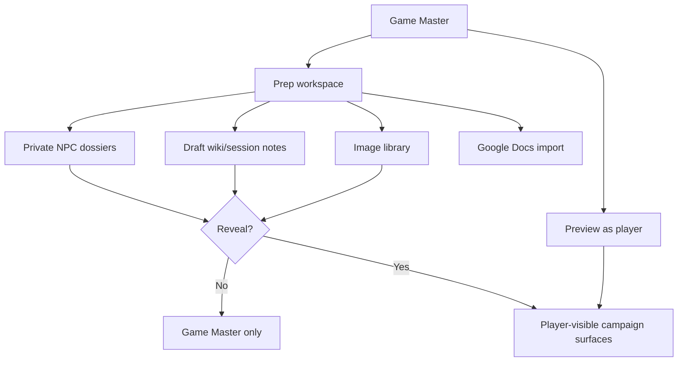
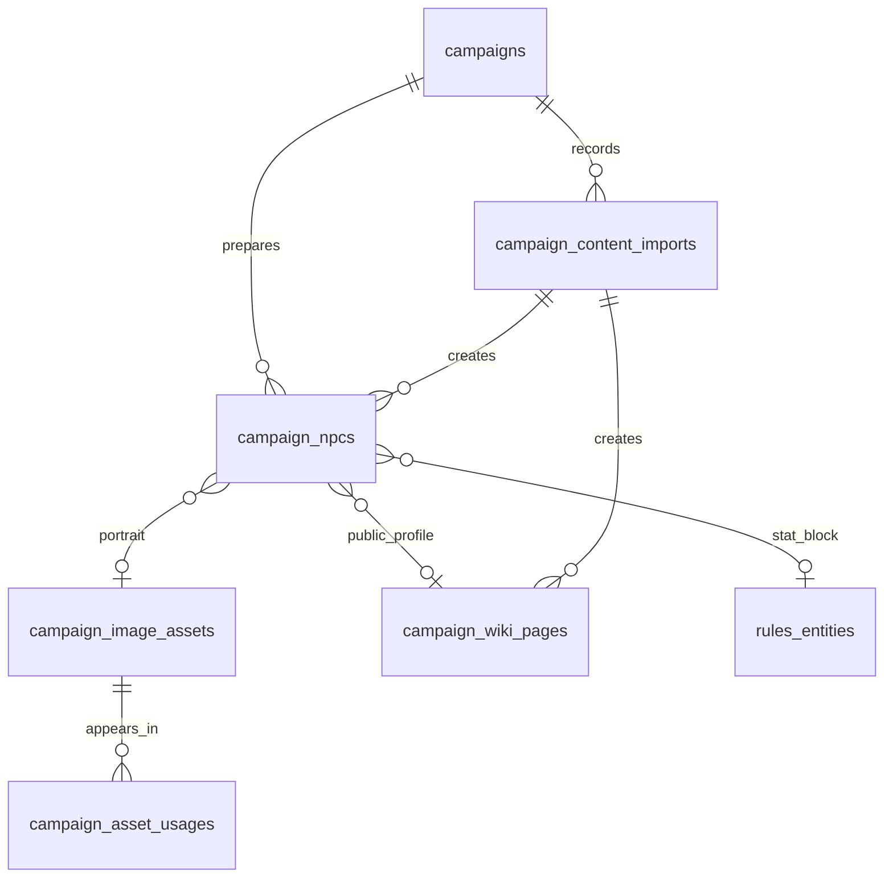

# Epic sheet-0061: Game Master Prep, Private NPCs, And Content Import

## Summary

Turn the existing campaign wiki, image asset, roster, and visibility foundations into a more useful
Game Master preparation workspace. The epic should let the Game Master keep unrevealed NPCs and
notes private, preview what players can see, reveal selected content deliberately, and import
campaign writing from Google Docs without repeated copy-paste.

This epic also closes the practical local-asset gap from the first hosted rehearsal: when the app
already references campaign images by app-managed storage keys, the Game Master or operator should
have a clear route to put matching local files in the asset root and see thumbnails render before
opening the full image.

## Goals

- Add a Game Master NPC workspace for private NPC dossiers and optional full sheet/stat-block views.
- Keep unrevealed NPCs out of player rosters, player wiki links, public routes, screenshots, and
  search surfaces until the Game Master marks them player-visible.
- Make campaign content visibility obvious for wiki pages, NPCs, notes, sessions, and images.
- Add a player-preview workflow so the Game Master can check what the table can currently see.
- Render campaign images as thumbnails or compact media cards before opening a larger detail view.
- Document and support the two local-image paths: place existing files under the configured asset
  root for already-referenced storage keys, or upload new files through the Game Master image form.
- Add a Google Docs import workflow that can turn existing Google Docs writing into wiki pages,
  session notes, NPC dossiers, or draft campaign notes.
- Preserve source metadata so imported material can be traced back to the original document without
  exposing private Drive URLs to players.
- Build new generic UI, transport, data lifecycle, and automation plumbing on the adopted Hyper-Dank
  package contracts where they fit, while keeping campaign-specific domain components and policies
  local to Campaign Ledger.
- Move Campaign Ledger onto the Hyper-Dank git workflow, including GitHub Issues and Projects
  integration for epics, tickets, pull requests, status tracking, and acceptance handoff.

## Non-Goals

- No production-grade shared Google Drive sync engine in the first slice.
- No automatic two-way Google Docs editing or background polling.
- No broad non-SRD commercial rules redistribution.
- No full encounter builder, combat tracker, or automated NPC rules calculation.
- No replacement of the existing local asset storage model with object storage or a CDN.
- No public exposure of Game Master-only content through local browser export.

## Users And Permissions

| Actor | Epic behaviour |
| --- | --- |
| Player | Sees only player-visible campaign pages, images, sessions, and revealed NPCs. |
| Game Master | Creates private NPCs, imports docs, manages images, previews player visibility, and reveals selected content. |
| Admin | Keeps account operations; does not gain play-edit or private-prep access unless they are also a campaign Game Master. |



## Key Workflows

- A Game Master creates an NPC dossier from the prep workspace, marks it Game-Master-only, attaches
  a portrait, and keeps it hidden from players.
- A Game Master later reveals the NPC. The NPC appears in player-visible campaign material without
  exposing private notes, unrevealed secrets, or hidden images.
- A Game Master opens the image library and sees thumbnail cards for maps, portraits, sigils, and
  covers. Selecting one opens a larger detail view with title, alt text, caption, visibility, asset
  status, and linked wiki/NPC usage.
- An operator who already has the local files for seeded images places them under the configured
  asset root at the referenced storage keys. The campaign image library and wiki thumbnails then
  render those files instead of the readable fallback.
- A Game Master uploads a new local image through the campaign image form. The app copies it into
  the asset root, stores an app-managed relative storage key, and makes it available as a thumbnail
  for wiki pages or NPC portraits.
- A Game Master imports a Google Docs document, previews the converted Markdown, chooses whether it
  becomes a wiki page, session record, NPC dossier, or draft note, sets visibility, and saves it.
- A Game Master uses player preview before a session to confirm that secret NPCs, Game Master-only
  notes, and private images are not visible to players.
- A maintainer starts each epic or ticket from the documented Hyper-Dank git flow, creates or links
  the matching GitHub Issue, keeps the issue in the configured GitHub Project status column, links
  the implementation PR, and records verification and acceptance evidence before closing the work.

## Existing Local Images

The current app already stores campaign image metadata in SQLite and serves files from an
app-managed asset root. The default local root is `data/assets`, unless `CAMPAIGN_LEDGER_ASSET_ROOT`
or the backwards-compatible `CHARACTER_SHEET_ASSET_ROOT` is configured.

When the database already references a seeded image, place the real file at the matching storage
key under the asset root. For the current Rovnost seed data, expected paths include:

```text
data/assets/campaigns/rovnost-shadows/cover.png
data/assets/campaigns/rovnost-shadows/magister-vallen.png
data/assets/campaigns/rovnost-shadows/faction-sigils.png
data/assets/campaigns/rovnost-shadows/astril-map.webp
data/assets/campaigns/rovnost-shadows/skywright-sigil.png
```

If the image is not already represented in the app, sign in as the Game Master and upload it from
the campaign image form. Uploaded files should continue to be copied into app-managed storage; the
database must never store absolute local source paths such as a desktop or downloads folder.

This epic should make that workflow visible in docs and UI so missing local files are easy to fix
without opening SQLite or reading seed code.

## Data And Interface Changes

- Extend character or campaign-content metadata so records can distinguish player characters,
  Game Master NPC dossiers, revealed NPCs, and optional full sheet/stat-block-backed NPCs.
- Add or reuse visibility values consistently across NPCs, wiki pages, images, sessions, and notes.
- Add private Game Master fields for NPC secrets, motivations, hooks, scene notes, and reveal notes.
- Link NPC dossiers to portrait image assets, wiki pages, sessions, factions, and rules/stat blocks
  where available.
- Add image-library read models that include thumbnail source, detail route, visibility, status,
  dimensions, upload/seeded state, and usage links.
- Add source-import metadata for Google Docs imports: source provider, document id or stable
  reference, source title, import timestamp, imported-by user, conversion notes, and last imported
  revision where available.
- Prefer the current `@macavitymadcap/hyper-dank-ui`, `@macavitymadcap/hyper-dank-transport`,
  `@macavitymadcap/hyper-dank-data`, and `@macavitymadcap/hyper-dank-automation` contracts for
  generic controls, request/response helpers, migration lifecycle boundaries, and verification
  helpers before adding new app-local framework code.
- Add GitHub workflow configuration and documentation for issue templates or issue forms, PR
  checklist expectations, project field/status conventions, branch naming, and issue-to-PR links
  following the accepted Hyper-Dank flow.
- Add route groups, expected as:
  - `/campaigns/:campaignSlug/prep`
  - `/campaigns/:campaignSlug/npcs`
  - `/campaigns/:campaignSlug/npcs/:npcSlug`
  - `/campaigns/:campaignSlug/images`
  - `/campaigns/:campaignSlug/images/:assetId`
  - `/campaigns/:campaignSlug/imports/google-docs`
  - `/campaigns/:campaignSlug/preview/player`



## Google Docs Import Approach

The safest first path is a staged import rather than silent sync:

1. Authenticate or configure access to the Game Master's Google Drive.
2. List or accept a Google Docs document reference from the Game Master.
3. Export the document to Markdown or HTML through an importer boundary.
4. Convert it to the app's safe Markdown subset.
5. Preview the converted content before saving.
6. Save as a draft or published player-visible/Game-Master-only campaign record.

If OAuth or Drive API setup becomes too large for this epic, the first implementation ticket may
land a manual exported-Markdown importer with the same preview and persistence model. The Google
Drive connector can then use that importer boundary without changing the campaign data model.

## Ticket Map

| Ticket | Purpose |
| --- | --- |
| `sheet-0062` | Adopt the Hyper-Dank git workflow with GitHub Issues, Projects, PR templates/checklists, branch conventions, and acceptance handoff documentation. |
| `sheet-0063` | Add Game Master prep, NPC dossier, reveal-state, and visibility schema foundations. |
| `sheet-0064` | Build the Game Master NPC workspace, private NPC creation, editing, and player-safe reveal controls. |
| `sheet-0065` | Add player-preview routes and visibility audit UI for wiki pages, sessions, NPCs, notes, and images. |
| `sheet-0066` | Add campaign image library thumbnails, image detail views, usage links, and local-file setup documentation. |
| `sheet-0067` | Add staged Markdown/Google Docs import models, preview conversion, source metadata, and draft save flows. |
| `sheet-0068` | Add Google Docs manual export and document-reference import against the staged importer boundary, with a documented future Drive API connector. |
| `sheet-0069` | Complete verification, accessibility, screenshots, docs, and acceptance notes for Game Master prep. |

## Branch Strategy

Create `sheet-0061` from the latest accepted `main` after `sheet-0050` has landed. Open the planning
pull request into `main`. Once accepted, keep or recreate `sheet-0061` as the epic integration
branch. Tickets `sheet-0062` through `sheet-0069` should branch from `sheet-0061`, open pull
requests back into `sheet-0061`, and be squash-merged there before the accumulated epic branch
targets `main`.

If this planning branch starts before `sheet-0050` lands, keep the branch as a proto epic only and
rebase or recreate it from the accepted roadmap before implementation tickets begin.

## Test And Verification Strategy

- Schema and repository tests cover NPC visibility, reveal state, portrait links, import metadata,
  image usage links, and campaign isolation.
- Guard tests prove player users cannot read unrevealed NPCs, private images, Game Master-only notes,
  or private imported drafts.
- Route tests cover NPC create/edit/reveal flows, image library/detail reads, player preview,
  Google Docs import preview, draft save, and forbidden access.
- Importer tests use tiny synthetic Google Docs export fixtures and do not commit private campaign
  prose unless it is intentionally safe.
- Component tests cover NPC lists/cards, reveal controls, image thumbnail cards, image detail views,
  visibility badges, import preview, and player-preview warnings.
- Compatibility tests keep new shared-package usage behind the accepted public Hyper-Dank package
  paths and preserve `bun run test:hyper-dank` as a guard against accidental app-local duplication.
- Workflow tests or documentation checks prove issue templates/forms, PR checklist guidance, project
  field conventions, and ticket references stay linked from README or architecture docs.
- Smoke coverage proves a Game Master can add a private NPC, attach a portrait, import a document,
  preview as player, reveal the NPC, and confirm the player can now see only the intended content.
- Accessibility and screenshots cover the prep workspace, NPC workspace, image library, image detail,
  import preview, and player-preview view in light and dark modes.
- `bun run verify` remains the source-code acceptance command.

## Risks And Assumptions

- Google Drive API/OAuth setup may require credentials and consent-screen decisions outside the
  repository. The epic should keep a manual exported-document path so the product value is not
  blocked by integration setup.
- Existing local images may have different filenames from seeded storage keys. The docs should make
  the expected destination names clear and avoid storing absolute source paths.
- Player preview can create false confidence if it does not use the same guards as real player
  routes. Preview routes must reuse the production visibility checks.
- NPCs may eventually need full stat blocks, but this epic should start with prep dossiers and link
  to rules/stat-block data where it already exists.
- Hyper-Dank packages are now in use, so implementation tickets should not reintroduce generic
  local primitives, request helpers, or script mechanics without first checking the accepted
  package boundary and documenting why the domain-specific local path is still needed.
- GitHub Projects and issue automation depend on repository and account-level settings that may not
  be fully configurable in source. The epic should document any manual setup and keep source-backed
  templates, checklists, and scripts useful even when project automation requires a human step.

## Acceptance Criteria

- Game Masters can create and maintain private NPC prep without players seeing unrevealed content.
- Game Masters can reveal selected NPC content while keeping private notes and secrets hidden.
- Campaign images render as thumbnails/cards before opening a larger detail view.
- Operators can place already-local seeded image files under the app-managed asset root and see them
  render without editing the database.
- New images can still be uploaded through Game Master UI and stored with app-managed relative keys.
- Google Docs writing can be imported through a staged preview flow into campaign wiki, session, NPC,
  or draft-note content.
- Imported content records source metadata without exposing private Drive details to players.
- Player preview accurately reflects player-visible campaign content.
- Documentation explains local asset roots, seeded storage keys, upload behaviour, and Google Docs
  import boundaries.
- New implementation keeps Campaign Ledger on the accepted Hyper-Dank package import paths wherever
  shared contracts fit, with app-local code reserved for campaign domain behaviour.
- The repository has a documented Hyper-Dank-style git flow backed by GitHub Issues, Projects, PR
  expectations, branch conventions, and acceptance evidence for the epic and its implementation
  tickets.
