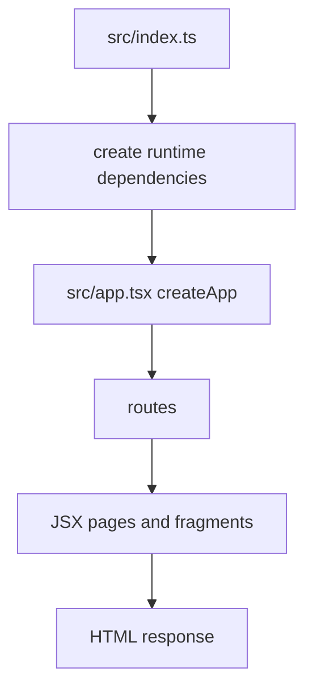

# Ticket sheet-0002: Scaffold Hono HTMX Application

## Summary

Create the initial Bun, Hono, HTMX, TypeScript, JSX, and SQLite project scaffold in `character-sheet`, using `pace-calculator` as the template.

## Implementation

- Add `package.json`, `tsconfig.json`, Bun runtime entrypoint, Hono `createApp()`, and a minimal home page.
- Add colocated component structure with atoms, pages, templates, and style aggregation.
- Add scripts for `dev`, `test`, `test:watch`, `typecheck`, and placeholder `test:a11y`.
- Add ignored SQLite database patterns and local cache directories.
- Add a simple health or home route to prove the app boots locally.

## Interfaces

- `createApp(dependencies)` returns a Hono app and owns route registration.
- `src/index.ts` exports Bun's `fetch` handler.
- Initial page components render full HTML through a `Layout` template.

## Tests First

- Write an `app.test.tsx` route test that calls `app.request("/")` and expects status `200`, `text/html`, and the app name.
- Write a `Layout.test.tsx` render test for document shell semantics.
- Write a smoke test that `createApp()` can be constructed with test dependencies.

## Acceptance Criteria

- `bun run dev` starts the local app.
- `bun run typecheck` passes.
- `bun run test` passes.
- The scaffold follows the component and style layout documented in `ARCHITECTURE.md`.
- No character-sheet source code depends on `pace-calculator` at runtime.
