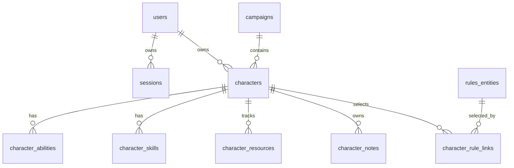

# Ticket sheet-0003: SQLite Schema, Repositories, And Seeds

## Summary

Add the SQLite schema, repository contracts, migration/bootstrap path, and MVP seed data for Lynott, the Game Master, and the admin.

## Implementation

- Create database bootstrap code that can initialise an empty SQLite database.
- Add repository interfaces for auth, characters, notes, campaign data, and rules read models.
- Add seed data for the three MVP users, Lynott's character summary, abilities, skills, core resources, and initial campaign.
- Keep the schema compatible with later Postgres migration by avoiding SQLite-only behaviour in route-facing contracts.

## Table Changes

- Add auth tables: `users`, `sessions`, `invites`, `password_reset_tokens`.
- Add play tables: `campaigns`, `campaign_members`, `campaign_sessions`.
- Add sheet tables: `characters`, `character_classes`, `character_abilities`, `character_skills`, `character_resources`, `character_equipment`, `character_notes`.
- Add rules tables: `rules_sources`, `rules_entities`, `rule_mechanics`, `character_rule_links`.

## Tests First

- Write in-memory SQLite tests for schema creation and idempotent bootstrap.
- Write repository tests for seeded users, Lynott's sheet lookup, resource reads, and note visibility.
- Write constraint tests for unique user emails, valid roles, non-negative resources, and one owner per character.

## Acceptance Criteria

- A fresh local database can be created and seeded.
- Repository tests run against SQLite `:memory:`.
- Lynott's seeded read model includes name, level, species, armour class, hit points, initiative, abilities, saves, and skills.
- Seed data does not require network access.
