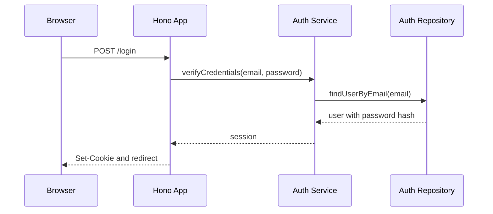

# Ticket sheet-0004: Local Authentication And Role Guards

## Summary

Implement local password authentication, signed sessions, role guards, seeded user login, admin invites, and admin-triggered password reset tokens.

## Implementation

- Add password hashing and verification service.
- Add session creation, lookup, expiry, and logout.
- Add login and logout routes and pages.
- Add role guards for player, Game Master, and admin access.
- Add local invite and password reset workflows without email delivery.

## Interfaces

- `AuthService.verifyCredentials(email, password)`.
- `SessionService.createSession(userId)`.
- `SessionService.readSession(cookieHeader)`.
- `requireRole(session, roles)`.
- `requireSheetAccess(session, characterId, permission)`.

## Tests First

- Write service tests for password verification, rejected credentials, expired sessions, and logout.
- Write route tests for login success, login failure, logout, protected-route redirects, and `403` for disallowed roles.
- Write admin route tests for invite creation and password reset token creation.

## Acceptance Criteria

- Seeded player, Game Master, and admin users can log in locally.
- Sessions are stored in SQLite and represented by HTTP-only cookies.
- Player users cannot access other users' write routes.
- Game Master and admin permission differences are enforced in route tests.
- Invite and reset tokens can be created and read locally by authorised users.
