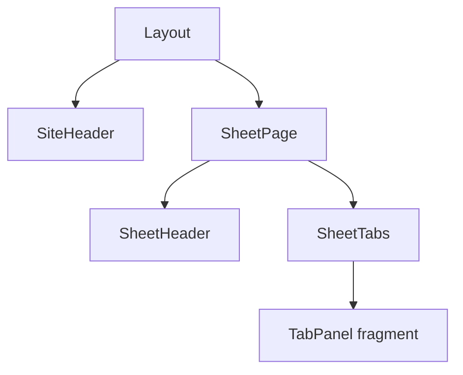

# Ticket sheet-0005: App Shell And Sheet Navigation

## Summary

Build the reusable app shell, sticky site header, sticky sheet header, tab navigation, and responsive layout for Lynott's sheet.

## Implementation

- Add site layout with app name, navigation menu, current user state, login, and logout.
- Add sheet page route and `SheetPage` composition.
- Add sticky `SheetHeader` with labelled outputs for name, species, level, armour class, hit points, initiative, conditions, inspiration, rest, and settings.
- Add tab navigation for the eight MVP sheet tabs.
- Add placeholder tab fragments that can be filled by later tickets.

## Interfaces

- `GET /sheet/:characterId` returns the full sheet page.
- `GET /sheet/:characterId/tabs/:tabId` returns an HTMX tab fragment.
- `SheetHeader` receives a sheet summary read model from the character repository.

## Tests First

- Write component tests for `SiteHeader`, `SheetHeader`, `SheetTabs`, and placeholder tab panels.
- Write route tests for authenticated sheet page rendering and unauthenticated redirects.
- Write HTMX tests that tab routes return fragment-only HTML.
- Write layout tests for sticky-region anchors such as `#site-header`, `#sheet-header`, and `#sheet-tabs`.

## Acceptance Criteria

- Lynott's sheet page renders after login.
- The site and sheet headers remain separate semantic regions.
- Tabs are accessible links or buttons with stable targets.
- Placeholder tab fragments can be swapped by HTMX.
- The layout uses British English names such as armour and defence.
