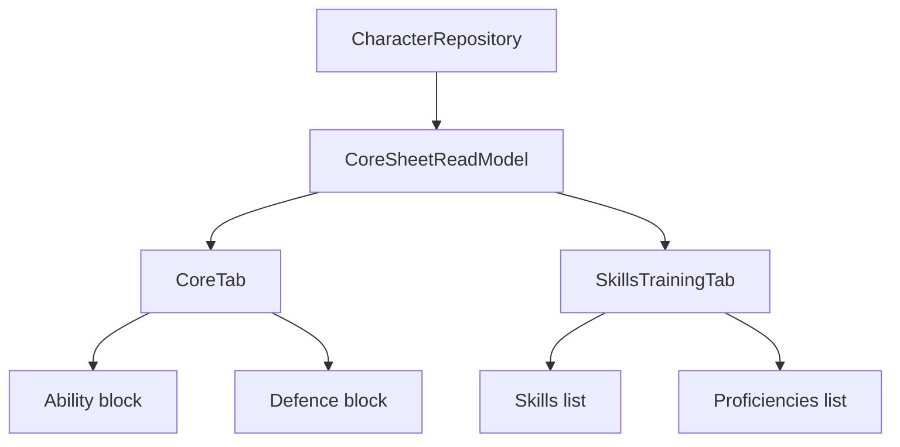

# Ticket sheet-0006: Core, Skills, And Defence Tabs

## Summary

Implement the core sheet tabs for abilities, saving throws, senses, speed, defence, skills, and proficiencies.

## Implementation

- Add read models for abilities, saves, senses, movement, armour class breakdown, defences, skills, proficiencies, tools, and languages.
- Render the `core` tab with ability scores, modifiers, saving throws, senses, speed, armour, and defence.
- Render the `skills and proficiencies` tab with skills, tool proficiencies, weapon proficiencies, armour proficiencies, and languages.
- Keep calculations server-side and covered by tests.

## Data Changes

- Use `character_abilities`, `character_skills`, `character_equipment`, and `character_rule_links`.
- Add missing seed rows for Lynott's skills, saves, senses, proficiencies, tools, languages, speed, and armour sources.

## Tests First

- Write repository tests for ability, save, skill, speed, senses, and armour-class read models.
- Write calculation tests for ability modifiers, proficient saves, proficient skills, expertise, and armour class.
- Write component tests for semantic tables/lists and labelled outputs.
- Write HTMX fragment tests for both tab routes.

## Acceptance Criteria

- Lynott's core tab shows correct ability scores, modifiers, saves, senses, speed, armour class, and defence data.
- Lynott's skill tab shows proficient skills, tool proficiencies, armour proficiencies, weapon proficiencies, and languages.
- Calculated values match the Lynott source document.
- All values render from SQLite read models, not hard-coded component props.
