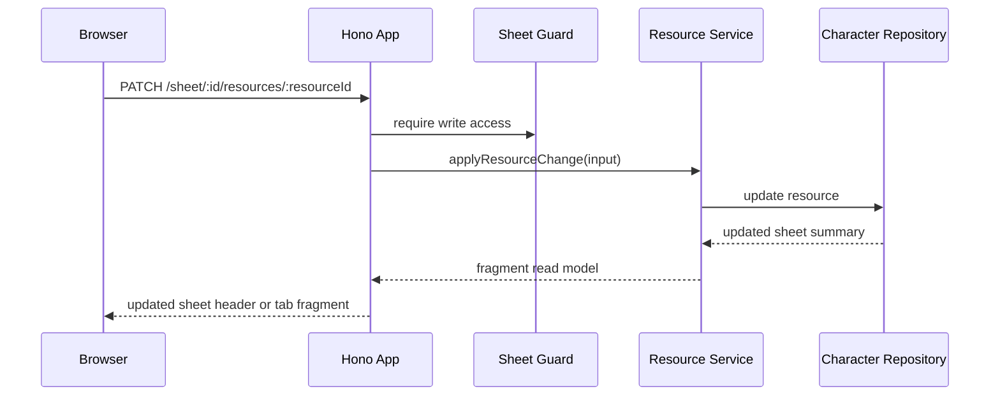

# Ticket sheet-0007: Actions, Spellcasting, Features, Equipment, And Resources

## Summary

Implement the action-facing sheet tabs: actions, spellcasting, features and traits, equipment, and mutable resource tracking.

## Implementation

- Add read models for attacks, actions, bonus actions, reactions, spells, spell slots, class features, species traits, infusions, equipment, and conditions.
- Add mutation routes for spending/restoring resources such as hit points, temporary hit points, hit dice, spell slots, inspiration, Fey Gift, Fortune from the Many, and conditions.
- Add short-rest and long-rest services that reset the correct resources for the MVP.
- Render spellcasting and rules text from structured rules data with source metadata.

## Data Changes

- Use `character_resources`, `character_equipment`, `rules_entities`, `rule_mechanics`, and `character_rule_links`.
- Add seed data for Lynott's pistol, Repeating Shot, Enhanced Defence, Artillerist features, Artificer features, prepared spells, and active resources.

## Tests First

- Write repository tests for actions, spellcasting, feature, trait, infusion, and equipment read models.
- Write service tests for resource spending, invalid resource changes, short rest, long rest, spell slot use, and condition updates.
- Write component tests for action rows, spell cards, feature lists, equipment lists, and resource controls.
- Write HTMX mutation tests that assert updated fragments and persisted state.

## Acceptance Criteria

- Lynott's action, spellcasting, feature, trait, and equipment tabs render from SQLite.
- Resource controls persist changes and update relevant fragments.
- Rest actions reset only the resources documented for the MVP.
- Routes reject unauthorised or invalid mutations.
