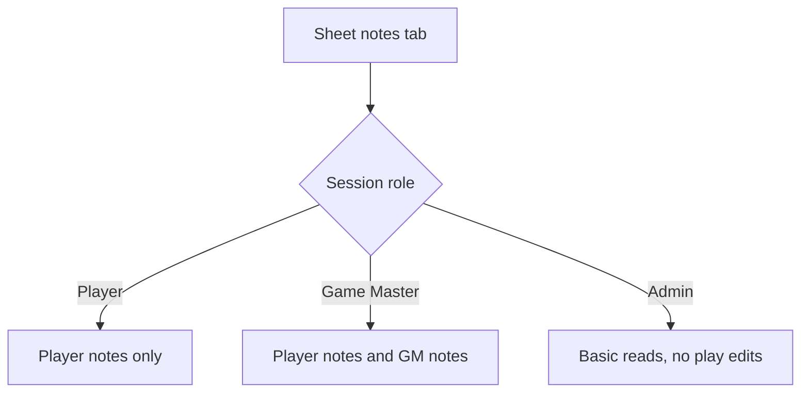

# Ticket sheet-0008: Background, Notes, Permissions, And Admin Reads

## Summary

Implement Lynott's background tab, player notes, Game Master notes, campaign/session records, note permissions, and admin read views.

## Implementation

- Add background read models for personality, ideals, bonds, flaws, backstory, false identities, NPCs, and military rank structure.
- Add player note and Game Master note forms.
- Add campaign/session read and write routes for Game Masters.
- Add admin views for users, invites, password reset tokens, characters, and campaigns.
- Enforce note visibility and mutation permissions in routes and services.

## Data Changes

- Use `character_notes`, `campaigns`, `campaign_members`, `campaign_sessions`, `users`, `invites`, and `password_reset_tokens`.
- Seed Lynott's background and NPC data from `docs/characters/Lynott-Magulbisson.md`.

## Tests First

- Write repository tests for background sections, player notes, Game Master notes, and campaign/session records.
- Write permission tests for player, Game Master, and admin note visibility.
- Write route tests for note creation, note update, session record creation, and admin read views.
- Write component tests for the background tab, notes tab, and admin tables.

## Acceptance Criteria

- Lynott's background tab contains the source backstory, false identities, NPCs, and rank structure.
- Players can manage player notes for their own character.
- Game Masters can manage Game Master notes and campaign/session records.
- Admins can see basic reads and manage invite/reset administration without gaining play-edit permissions.
