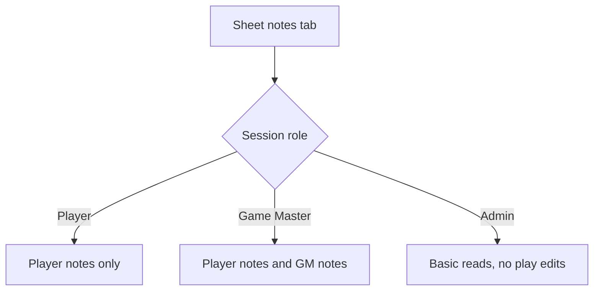

# Ticket sheet-0008: Background, Notes, Permissions, And Admin Reads

## Summary

Implement Lynott's background tab, seeded player and Game Master note editing, note permissions, a read-only campaign shell, and the basic admin shell.

## Implementation

- Add background read models for personality, ideals, bonds, flaws, backstory, false identities, NPCs, and military rank structure.
- Add forms for editing seeded player and Game Master notes.
- Add a read-only campaign page for the seeded Game Master route.
- Add the admin page shell and local invite form; broader admin read tables and user-management screens are deferred.
- Enforce note visibility and mutation permissions in routes and services.

## Data Changes

- Use `character_notes`, `campaigns`, `campaign_members`, `campaign_sessions`, `users`, `invites`, and `password_reset_tokens`.
- Seed Lynott's background and NPC data from `docs/characters/Lynott-Magulbisson.md`.

## Tests First

- Write repository tests for background sections, seeded player notes, seeded Game Master notes, and campaign membership reads.
- Write permission tests for player, Game Master, and admin note visibility.
- Write route tests for note update, campaign shell access, and admin shell access.
- Write component tests for the background tab, notes tab, campaign shell, and admin invite form.

## Acceptance Criteria

- Lynott's background tab contains the source backstory, false identities, NPCs, and rank structure.
- Players can edit the seeded player-visible note for their own character.
- Game Masters can edit seeded player and Game Master notes and view the seeded campaign shell.
- Admins can access the admin shell and create invites without gaining play-edit permissions.
- Note creation, campaign/session record management, admin read tables, and fuller user management are explicitly deferred.
