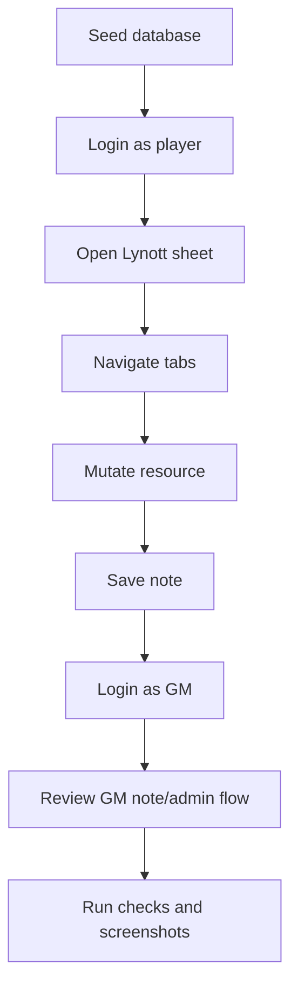

# Ticket sheet-0010: MVP Verification, Accessibility, Screenshots, And Documentation Polish

## Summary

Complete the MVP acceptance pass with accessibility coverage, visual screenshots, docs updates, and end-to-end verification of the local sheet workflow.

## Implementation

- Add or complete Pa11y coverage for home, login, sheet, tab fragments where practical, and admin pages.
- Add screenshot capture for Lynott's sheet in light and dark mode.
- Add final README, architecture, and contribution updates reflecting implemented scripts and commands.
- Add an MVP smoke workflow covering seed, login, sheet navigation, resource mutation, notes, admin reads, and logout.
- Fix visual, accessibility, and documentation issues discovered by verification.

## Tests First

- Write smoke tests for the MVP workflow before filling any missing behaviour.
- Write accessibility script expectations before fixing violations.
- Write screenshot script assertions for output paths and required view states.
- Write documentation checks for known local commands and key markdown links.

## Acceptance Criteria

- `bun run typecheck` passes.
- `bun run test` passes.
- `bun run test:a11y` passes.
- Screenshot capture works for the sheet's main states.
- README and architecture match the implemented scripts and runtime behaviour.
- The MVP can be run locally from a fresh checkout and seeded database.
