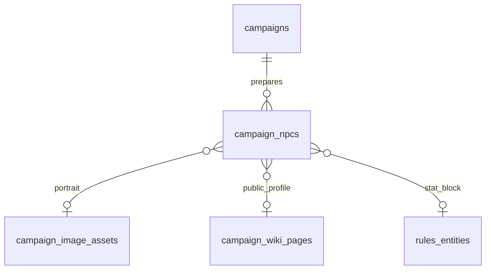

# Ticket sheet-0063: Game Master Prep And NPC Foundations

## Summary

Add the data, repository, and guard foundations for a Game Master prep workspace with private NPC
dossiers, reveal state, player-safe public profiles, and optional links to portraits, wiki pages,
and rules/stat blocks.

This ticket intentionally stops at foundations. User-facing NPC management lands in `sheet-0064`,
and player preview lands in `sheet-0065`.

## Dependencies

- Builds on `sheet-0062` for the GitHub workflow and ticket/PR conventions.
- Builds on existing campaign membership, wiki, image asset, and visibility tables.

## Implementation

- Add `campaign_npcs` schema for campaign NPC dossiers, including campaign id, slug, name, visibility/reveal state,
  public summary, Game Master-only notes, secrets, motivations, hooks, scene notes, reveal notes,
  optional portrait image asset, optional public wiki page, optional rules/stat-block link, and
  timestamps.
- Model reveal state explicitly enough to distinguish Game-Master-only drafts from player-visible
  NPCs without exposing private notes.
- Add repository methods for creating, reading, updating, listing, and revealing NPC dossiers.
- Add read models for Game Master prep lists and player-visible NPC summaries.
- Reuse existing campaign membership guards so only campaign Game Masters can mutate prep data, and
  players can only read revealed/player-visible summaries.
- Seed one tiny synthetic private NPC fixture for repository and route tests; do not commit private
  campaign prose.
- Update architecture docs with the new table, repository boundary, and visibility model.

## Data And Interfaces

- Tables: `campaign_npcs`.
- Repositories: `CampaignContentRepository` NPC methods.
- Guards: campaign membership and Game Master management checks.
- Read models in `src/db/model.ts` and SQLite implementation in `src/db/sqlite.ts`.
- Architecture data-model section and route planning notes.

## Tests First

- Add schema tests for required fields, slug uniqueness per campaign, visibility/reveal constraints,
  and safe optional foreign keys.
- Add repository tests for Game Master list/read, player-visible list/read, create/update, reveal,
  and campaign isolation.
- Add guard tests proving admin capability alone does not grant NPC prep access.
- Add regression tests proving private notes, secrets, and Game Master fields never appear in
  player read models.

## Acceptance Criteria

- Campaign NPC prep data can be stored and read through repository interfaces.
- Game Masters can see private and revealed NPC dossier data through read models.
- Players can only see revealed/player-visible NPC summaries.
- Private notes and secrets are not exposed through player read models.
- NPC records can link to portrait assets, wiki pages, and rules/stat-block entities where present.
- The architecture docs describe the data shape and visibility boundary.
- `bun run verify` passes.
