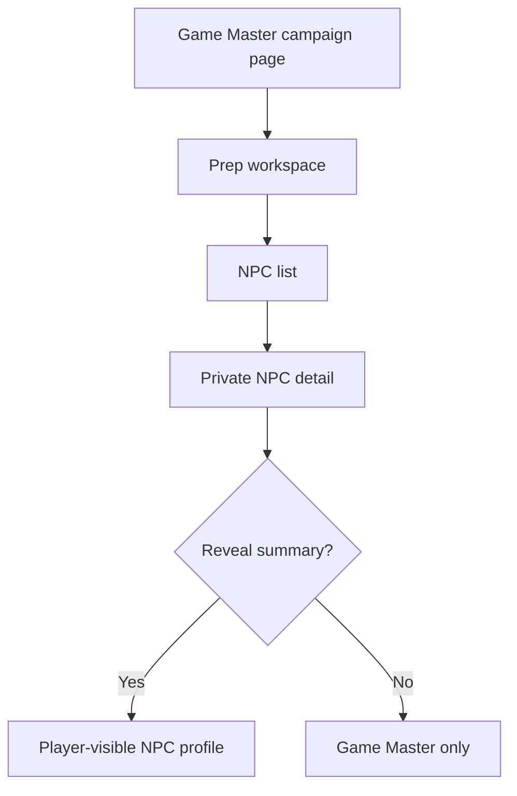

# Ticket sheet-0064: Game Master NPC Workspace

## Summary

Build the Game Master-facing NPC workspace so a Game Master can create, edit, review, and reveal NPC
dossiers from the campaign prep area.

This turns the `sheet-0063` data foundations into a usable table-prep workflow while keeping player
visibility controlled by the same guards.

## Dependencies

- Requires `sheet-0063` NPC schema, repositories, read models, and guards.
- Uses existing campaign image assets for optional NPC portraits.
- Uses Hyper-Dank UI primitives where their contracts fit generic forms, panels, badges, and lists.

## Implementation

- Add campaign prep and NPC routes, expected as `/campaigns/:campaignSlug/prep`,
  `/campaigns/:campaignSlug/npcs`, and `/campaigns/:campaignSlug/npcs/:npcSlug`.
- Add Game Master-only create and edit forms for NPC name, public summary, private notes, secrets,
  motivations, hooks, scene notes, reveal notes, portrait asset, public profile/wiki link, and
  optional rules/stat-block link.
- Add reveal controls that make the public NPC summary visible to players without exposing private
  fields.
- Add list and detail components that separate private Game Master information from player-visible
  profile information.
- Keep the existing campaign page linked to the new prep/NPC workspace instead of growing the
  current long management surface further.
- Preserve full-page navigation first; add HTMX fragments only for focused create/edit/reveal swaps
  where they reduce repeated page reloads without increasing complexity.
- Update README or architecture navigation docs with the new prep and NPC routes.

## Interfaces

- Routes: `/campaigns/:campaignSlug/prep`, `/campaigns/:campaignSlug/npcs`,
  `/campaigns/:campaignSlug/npcs/:npcSlug`.
- Mutations: NPC create, edit, reveal/hide, and optional portrait/profile links.
- Components/pages: `CampaignPrepPage`, `NpcListPage`, and `NpcDetailPage`.
- Existing `CampaignPage` navigation.

## Tests First

- Add route tests proving players and non-members cannot open NPC prep routes.
- Add route tests for create, edit, validation errors, and reveal/hide flows before implementing
  handlers.
- Add component tests for NPC list empty state, private detail state, portrait selection, reveal
  controls, and clear visibility labels.
- Add tests proving player-visible pages do not contain private notes, secrets, or hidden portrait
  references after reveal.
- Add screenshot targets for the prep workspace, NPC list, NPC detail, and reveal state in light and
  dark modes.

## Acceptance Criteria

- A Game Master can create and edit a private NPC dossier from the browser.
- A Game Master can reveal an NPC summary to players without revealing private notes.
- NPC routes enforce campaign membership and Game Master permissions.
- The campaign page links to the prep/NPC workflow without adding more dense management sections.
- NPC list and detail screens are scannable on mobile and desktop.
- Screenshots and accessibility checks cover the new GM-facing NPC workflow.
- `bun run verify` passes.
