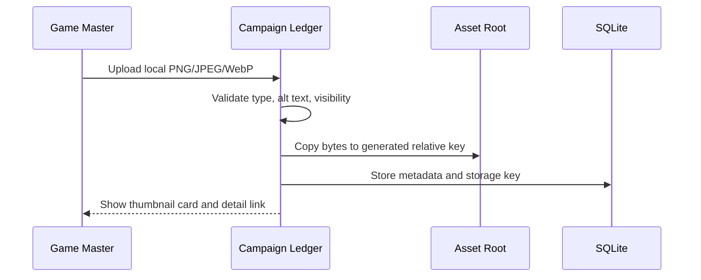

# Ticket sheet-0066: Campaign Image Library And Local Photo Workflow

## Summary

Turn the existing campaign image upload form into a proper image library for Game Masters, with
thumbnail cards, detail views, usage links, visibility labels, and clear local-photo setup
documentation.

After this ticket, a Game Master should be able to choose a PNG, JPEG, or WebP from this computer,
upload it, see it in the campaign image library, open its details, understand whether players can
see it, and attach or reference it from campaign material.

## Dependencies

- Builds on existing campaign image asset upload/storage routes.
- Builds on `sheet-0064` for NPC portrait usage links in the image detail view.
- Builds on `sheet-0065` for player-preview evidence that private images stay hidden.

## Implementation

- Split or link image management from the campaign page to `/campaigns/:campaignSlug/images` and
  `/campaigns/:campaignSlug/images/:assetId`.
- Preserve the existing `POST /campaigns/:campaignSlug/assets` upload route as the upload mutation
  used by the new image library, so existing route tests and forms keep their contract.
- Keep uploads app-managed: copy the selected local file into `CAMPAIGN_LEDGER_ASSET_ROOT` or
  `data/assets`, store only a generated relative storage key, and never store absolute local source
  paths.
- Accept PNG, JPEG, and WebP files; reject unsupported types and missing alt text.
- Render image thumbnail cards with title, caption, alt text summary, visibility, seeded/uploaded
  state, dimensions, byte size, missing/fallback state, and usage count.
- Add image detail views with the full image, metadata, linked wiki/NPC/session/faction usage that
  exists in the database, and guidance for referencing the image from wiki or NPC content.
- Document the two local-photo paths: copying known seeded files into the expected asset-root paths,
  and uploading new files through the Game Master UI.
- Keep protected image reads behind campaign membership and visibility checks.

## Interfaces

- Routes: `/campaigns/:campaignSlug/images`, `/campaigns/:campaignSlug/images/:assetId`,
  existing `/campaigns/:campaignSlug/assets/:assetId`, and the upload mutation.
- Components/pages: image library, image detail, image upload form, image metadata/status chips.
- Tables: `campaign_image_assets`, `campaign_wiki_page_assets`, and any NPC/session/faction usage
  links available by this point.
- Docs: README local setup, architecture asset storage notes, and ticket acceptance notes.

## Tests First

- Add route tests for opening image library/detail pages as Game Master, player, and outsider.
- Add upload tests for PNG, JPEG, WebP, missing alt text, unsupported MIME type, and generated
  storage keys that do not include the source filename or absolute path.
- Add repository/read-model tests for image usage counts and seeded/uploaded/fallback state.
- Add component tests for thumbnail cards, detail metadata, empty states, visibility labels, and
  local-photo guidance.
- Add screenshot targets for image library and image detail views in light and dark modes.
- Add player-preview tests proving Game-Master-only images are not visible to players.

## Acceptance Criteria

- A Game Master can upload a photo from this computer through the browser.
- Uploaded files are copied into the app-managed asset root and stored with relative generated keys.
- PNG, JPEG, and WebP uploads work; unsupported files and missing alt text are rejected.
- The image library shows thumbnail cards with visibility, source, dimensions, fallback, and usage
  information.
- The image detail view shows the full image and linked campaign usage from wiki, NPC, session, or
  faction records that reference the asset.
- Players can only read player-visible images for campaigns they belong to.
- Docs explain seeded-file placement and new local upload behaviour.
- `bun run verify` passes.
