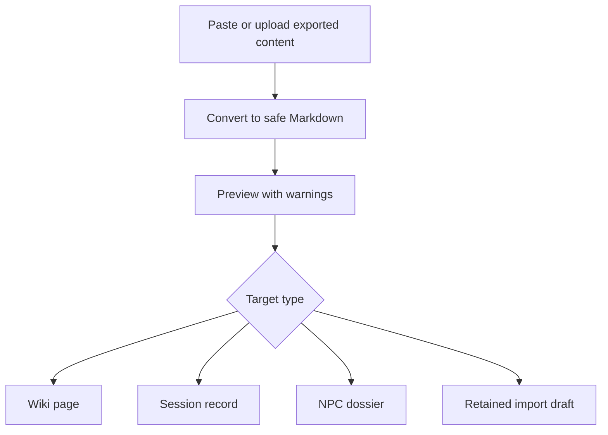

# Ticket sheet-0067: Staged Content Import Models And Preview

## Summary

Add the app-owned staged import model for campaign writing so Game Masters can paste or upload
exported Markdown/HTML, preview the converted content, choose a target type, set visibility, and
save it as a wiki page, session record, NPC dossier, or retained import draft.

This ticket delivers useful import value without depending on Google Drive API credentials.

## Dependencies

- Builds on `sheet-0063` and `sheet-0064` for NPC target support.
- Builds on existing campaign wiki/session creation flows.
- Runs before `sheet-0068`, which adds Google Docs manual export and document-reference import on
  top of this boundary.

## Implementation

- Add a `campaign_content_imports` metadata table for staged campaign content imports, including campaign id, provider,
  source title, stable source reference, imported-by user, imported timestamp, target type, target
  record id, conversion notes, and visibility.
- Add a conversion boundary that accepts pasted Markdown and a small safe HTML subset, then produces
  the app's safe Markdown subset used by campaign wiki rendering.
- Add provider-neutral staged import routes:
  - `/campaigns/:campaignSlug/imports`
  - `/campaigns/:campaignSlug/imports/preview`
  - `/campaigns/:campaignSlug/imports/save`
- Add a preview step before persistence. The preview must show converted Markdown, detected title,
  target type, visibility, and warnings about private Drive URLs or unsupported content.
- Add save actions for wiki page, session record, NPC dossier, or retained import draft. Unsupported
  target combinations should be explicit validation errors.
- Preserve source metadata without exposing private Drive URLs to player-visible pages.
- Use tiny synthetic fixtures only; do not commit private campaign prose.

## Interfaces

- Tables: `campaign_content_imports`.
- Services: import conversion/normalisation boundary.
- Routes: staged import form, preview, save.
- Components/pages: import form, preview page, conversion warnings, target selector.
- Existing wiki, session, and NPC repositories.

## Tests First

- Add service tests for Markdown and small HTML conversion before adding routes.
- Add tests proving private Drive URLs or unsupported embeds are removed from player-visible output
  and reported as preview warnings.
- Add schema/repository tests for import metadata, target links, campaign isolation, and visibility.
- Add route tests for preview, validation errors, and saving to each supported target type.
- Add component tests for target selection, visibility controls, preview warnings, and converted
  content rendering.
- Add smoke coverage for a Game Master importing synthetic content into at least one campaign target.

## Acceptance Criteria

- A Game Master can stage pasted/exported campaign writing and preview converted Markdown before
  saving.
- The importer can save safe content as a wiki page, session record, NPC dossier, or retained import
  draft, using the target repositories available after `sheet-0064`.
- Import metadata records source/provider details and target record links.
- Player-visible content never exposes private Drive URLs or unsupported raw embeds.
- Synthetic fixtures cover conversion behaviour without committing private campaign prose.
- The staged importer boundary is ready for Google Docs manual export and document-reference import
  in `sheet-0068`.
- `bun run verify` passes.
